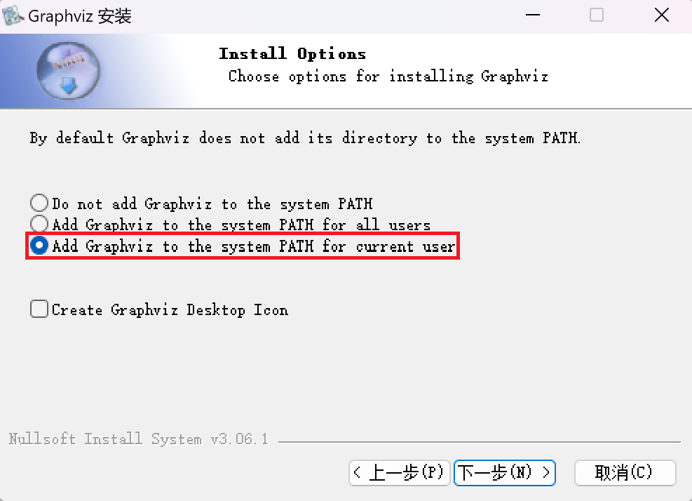
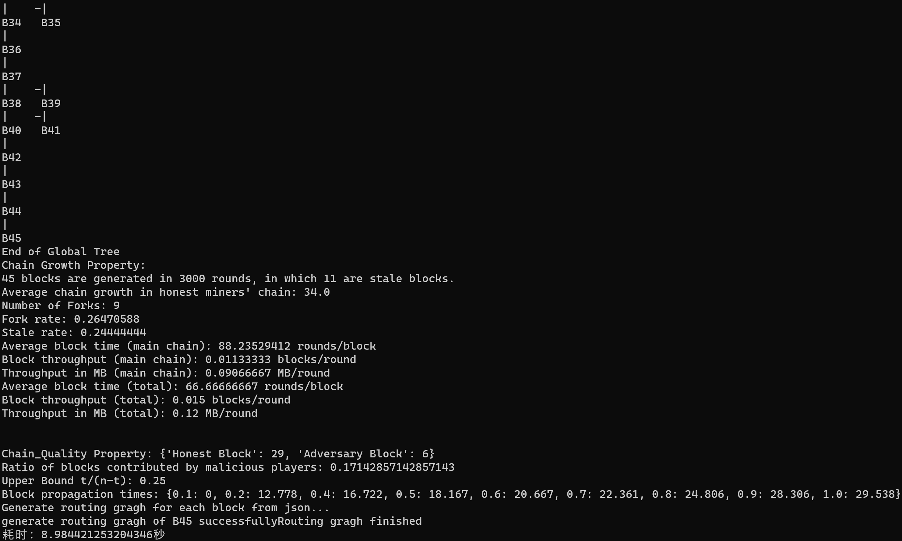
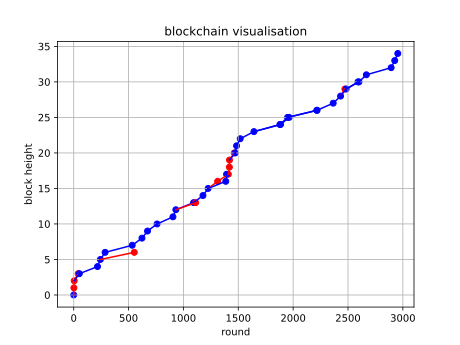
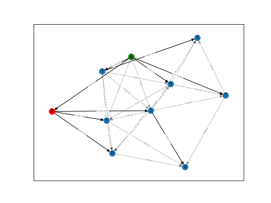
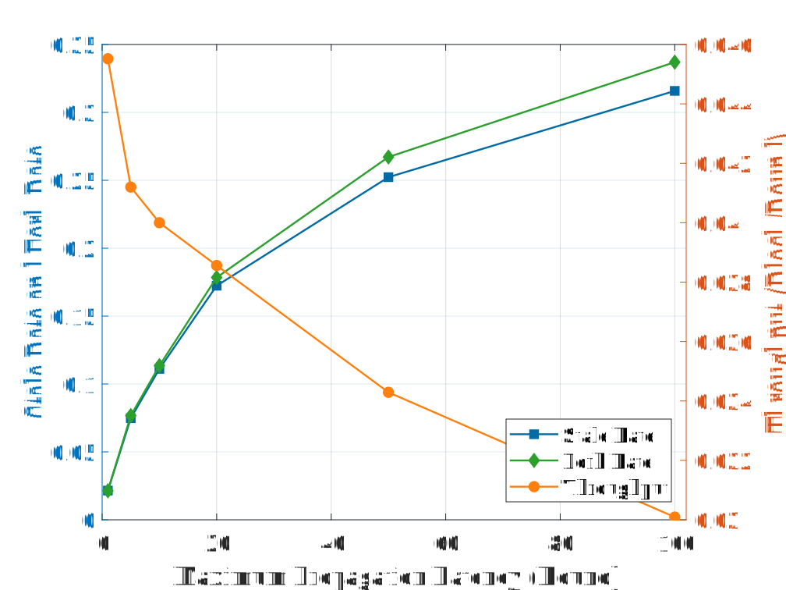
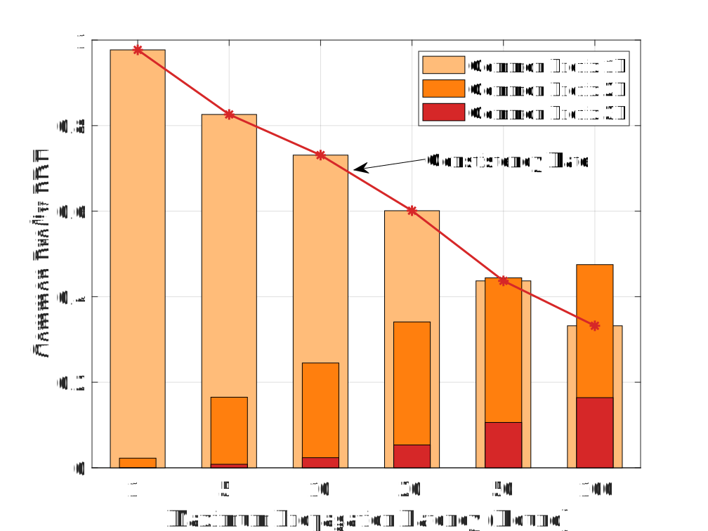
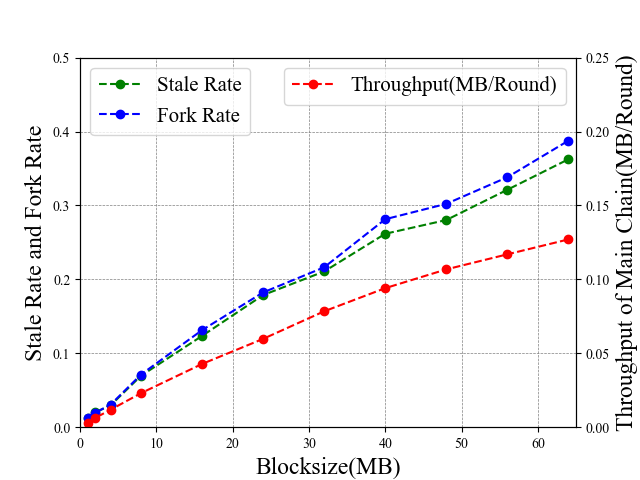
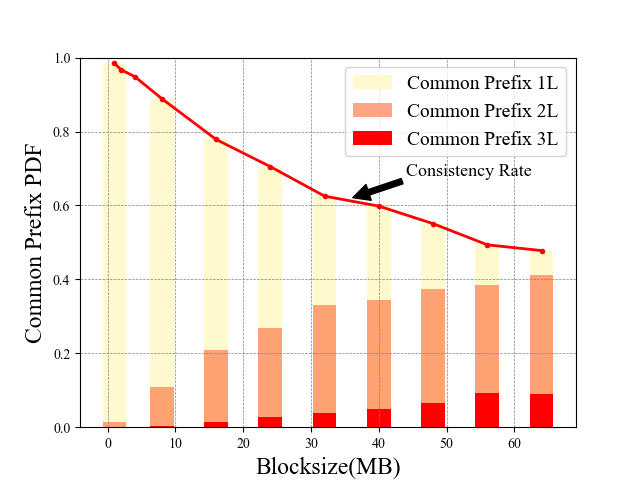
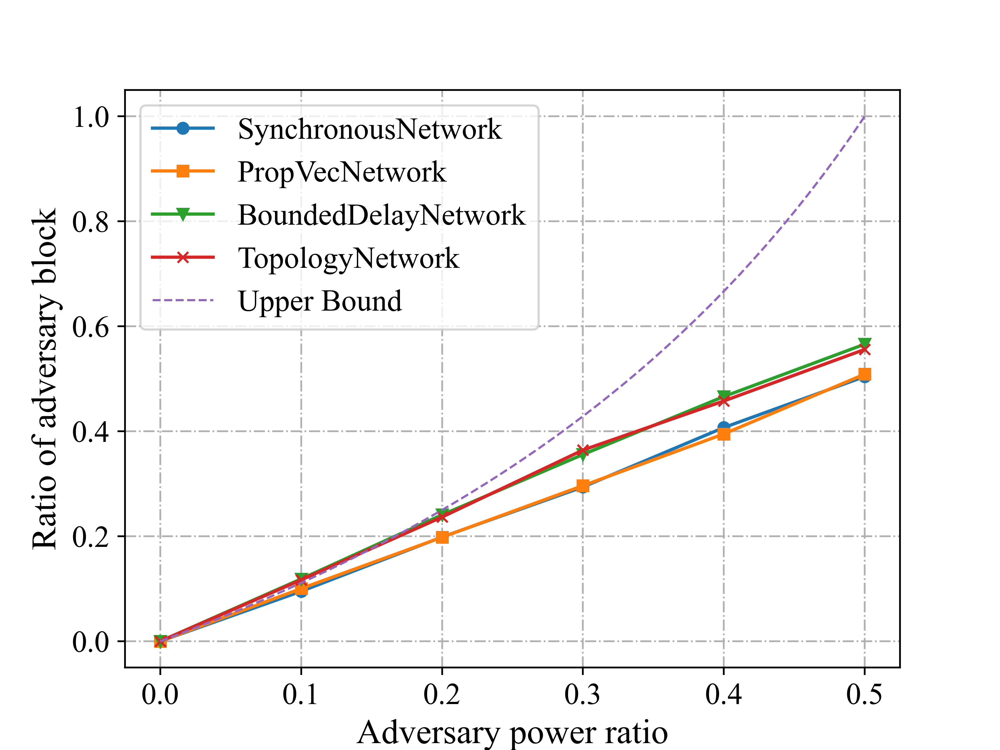
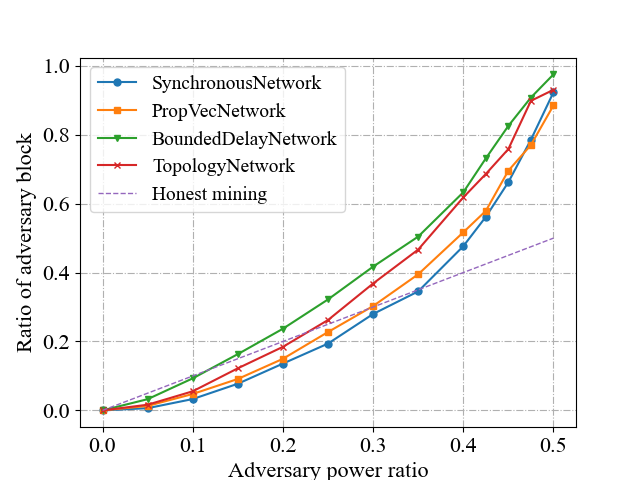

# ChainXim 用户指南
## 简介

ChainXim是一款由XinLab开发的区块链仿真器，用于对不同参数设置下的区块链系统进行仿真验证。我们希望ChainXim能够兼容不同的共识协议、网络模型，并可以设计不同的攻击者，从多个维度全方位评估区块链的安全、吞吐等性能指标。目前仿真器还处于内部测试阶段。

## Quick Start
### 下载
可以下载ChainXim的压缩包后解压，或者克隆位于Gitee上的软件仓库

可在ChainXim的代码仓库下载master分支的压缩包：[master.zip](https://gitee.com/geekczx/chain-xim/repository/archive/master.zip)

git克隆命令：`git clone https://gitee.com/geekczx/chain-xim.git`

### 文件结构
压缩包解压后或软件仓库克隆后的文件结构如下：
```
chain-xim
    ├── Attack.py
    ├── Environment.py
    ├── README.md
    ├── chain.py
    ├── consensus
    │   ├── __init__.py
    │   ├── consensus_abc.py
    │   ├── pow.py
    ├── errors.py
    ├── external.py
    ├── functions.py
    ├── global_var.py
    ├── main.py
    ├── miner.py
    ├── network
    │   ├── __init__.py
    │   ├── bounded_delay_network.py
    │   ├── network_abc.py
    │   ├── propvec_network.py
    │   ├── synchronous_network.py
    │   └── topology_network.py
    ├── network_topolpgy.csv
    ├── network_topolpgy_coo.csv
    └── system_config.ini
```

| 文件或目录 | 功能描述 |
| -------- | -------- |
| main\.py  | 仿真器主程序 |
| system_config\.ini | 配置文件 |
| README.md | 用户文档 |
| Environment\.py | 环境类与相关函数 |
| Miner\.py | 矿工类与相关函数 |
| chain\.py | BlockHead、Block、Chain类与相关函数 |
| consensus/ | 存放抽象共识类、PoW类与相关函数的目录 |
| network/ | 存放多种网络类的目录 |
| Attack\.py | 攻击者类与相关函数 |
| functions\.py | 包含计算哈希（SHA256）在内的一些函数 |
| external\.py | 一些用于统计区块链指标的外部函数 |
| errors\.py | 错误类，用于在仿真器中抛出错误 |
| global_var\.py | 存放全局变量 |

### 配置环境
1. 安装Anaconda。[Anaconda下载链接](https://www.anaconda.com/download)
2. 安装Graphviz，安装过程中需注意在Install Options页面选中`Add Graphviz to the system PATH for current user`。[Graphviz下载链接](https://gitlab.com/api/v4/projects/4207231/packages/generic/graphviz-releases/7.1.0/windows_10_cmake_Release_graphviz-install-7.1.0-win64.exe)



3. 从开始菜单打开Anaconda Prompt。
4. 生成一个conda环境并激活，Python版本选择3.9。
```
conda create -n chainxim python=3.9
activate chainxim
```
5. 在ChainXim的根目录下通过pip安装所需要的包。
```
cd <project_directory>
pip install -r requirements.txt
```

### 简单运行
1. 从开始菜单打开Anaconda Prompt，运行前需要激活conda环境。
```
activate chainxim
```
2. 在ChainXim的根目录下运行主程序。
```
cd <project_directory>
python main.py
```


## 测试用例 
将以下参数传递给主程序，将会使ChainXim随机生成一个包含10个节点的矿工网络，其中2个节点为攻击者，采用的网络模型为TopologyNetwork，仿真总共持续3000轮次。
```
python main.py --total_round 3000 --miner_num 10 -t 2 --network_type network.TopologyNetwork --no_compact_outputfile --save_routing_graph --show_label
```
仿真开始后会输出仿真参数，并在仿真进行时显示进度条。
```
Network Attributes
    miner_num: 10
    Generate Approach: rand
    Generate Edge Probability: 0.8
    Diameter: 2
    Average Shortest Path Length: 1.356
    Degree Histogram: [0, 0, 0, 0, 3, 1, 3, 2, 0, 1]
    Average Degree: 5.8
    Average Cluster Coefficient: 0.689
    Degree Assortativity: -0.251


Parameters:
Miner Number: 10
Adversary Miners: [8, 6]
Consensus Protocol: PoW
Network Type: TopologyNetwork
Network Param:  {'show_label': True, 'save_routing_graph': True, 'ave_degree': 8.0, 'bandwidth_honest': 0.5, 'bandwidth_adv': 5.0, 'TTL': 500, 'gen_net_approach': 'rand', 'block_prop_times_statistic': [0.1, 0.2, 0.4, 0.5, 0.6, 0.7, 0.8, 0.9, 1.0]}
Consensus Param: {'target': '000FFFFFFFFFFFFFFFFFFFFFFFFFFFFFFFFFFFFFFFFFFFFFFFFFFFFFFFFFFFFF', 'q_ave': 5, 'q_distr': 'equal'}
Attack Execute Type: execute_sample1
```
仿真结束后将输出仿真结果：



此外，仿真过程中产生的各类数据将保存在Results文件夹，包括每个矿工的区块链记录、区块链可视化矢量图、区块链攻击者日志、路由历史、网络拓扑图、区块传播示意图等。注意如果缺失命令行参数`--no_compact_outputfile --save_routing_graph`，部分文件可能缺失。

-----
区块链可视化矢量图（[blockchain_visualization/Blockchain Structure.gv.svg](doc/Blockchain-Structure.svg)）
<br><br/>


<br><br/>

图中红色区块由攻击者产生，蓝色区块由诚实矿工产生。

-----
区块链可视化图（[blockchain visualisation.svg](doc/blockchain-visualisation.svg)）



图中每个点代表一个区块，蓝点代表诚实矿工产生的区块，红点代表攻击者产生的区块。每个点的横坐标表示区块产生的轮次，纵坐标表示区块所在高度。**注意，如果运行轮数过多，产生的区块数过多，会导致生成的图片挤成一团，难以分辨**

-----
网络拓扑图（[Network Results/network topology.svg](doc/network-topology.svg)）


图中相邻节点之间标记了传输带宽，单位为MB/round。

-----
区块传播示意图（以区块B2为例：[Network Results/routing_graphB2.svg](doc/routing-graphB2.svg)）



上图展示了区块B2从节点6传播到整个网络的全过程，图中每个实心箭头都带有含两对正数的标记，第一对标识某一传播过程源矿工与目标矿工的ID，第二对标识某一传播过程的起始轮次与结束轮次。

## 仿真器输入参数
仿真器的输入参数可以通过两种方式指定：命令行以及配置文件。一般情况下可以修改ChainXim附带的配置文件system_config.ini以改变仿真参数，也可以通过命令行指定个别仿真参数。命令行支持的参数少于配置文件，但是一旦被指定，优先级高于配置文件，可以通过`python main.py --help`命令查看命令行帮助信息。

### EnvironmentSettings

配置仿真环境

| system_config      | 命令行示例                                   | 类型  | 说明                                                         |
| ------------------ | -------------------------------------------- | ----- | ------------------------------------------------------------ |
| total_round        | `--total_round 50`                           | int   | 仿真总轮次数                                                 |
| process_bar_type   | `--process_bar_type round`                   | str   | 进度条显示风格（round或height）                              |
| miner_num          | `--miner_num 80`                             | int   | 网络中的矿工总数                                             |
| blocksize          | `--blocksize 8`                              | float | 区块大小，单位MB                                           |
| consensus_type     | `--consensus_type consensus.PoW`             | str   | 共识类型，目前仅`consensus.PoW`可选                          |
| network_type       | `--network_type network.SynchronousNetwork ` | str   | 网络类型，`network.SynchronousNetwork`、<br/>`network.PropVecNetwork`、`network.BoundedDelayNetwork`、<br/>`network.TopologyNetwork`四选一 |
| show_fig           | `--show_fig`                                 | bool  | 是否显示仿真过程中的图像                                     |
| compact_outputfile | `--no_compact_outputfile`                    | bool  | 是否简化log和result输出以节省磁盘空间<br/>通过`--no_compact_outputfile`设置为False |

### ConsensusSettings

配置共识协议参数

| system_config | 命令行示例        | 类型 | 说明                                                         |
| ------------- | ----------------- | ---- | ------------------------------------------------------------ |
| q_ave         | `--q_ave 5`       | int  | 单个矿工的平均哈希率，即每轮能计算哈希的次数                 |
| q_distr       | `--q_distr equal` | str  | 哈希率的分布模式<br>equal：所有矿工哈希率相同；<br>rand：哈希率满足高斯分布 |
| target        | 无                | str  | 16进制格式的PoW目标值                                        |
| 无            | `--difficulty 12` | int  | 用二进制PoW目标值前缀零的长度表示的PoW难度，<br/>在主程序转换为PoW目标值 |

### AttackModeSettings

配置攻击模式参数

| system_config       | 命令行示例                               | 类型  | 说明                                                         |
| ------------------- | ---------------------------------------- | ----- | ------------------------------------------------------------ |
| t                   | `-t 0`                                   | int   | 攻击者总数                                                   |
| adversary_ids       | 无                                       | tuple[int] | 攻击者id e.g.(1,3,5)                            |
| attack_execute_type | `--attack_execute_type execute_sample1 ` | str   | 攻击类型<br>execute_sample0：算力攻击；<br>execute_sample1：自私挖矿 |

### PropVecNetworkSettings

配置PropVecNetwork参数

| system_config | 类型        | 说明                                                         |
| ------------- | ----------- | ------------------------------------------------------------ |
| prop_vector   | list[float] | 传播向量（以列表形式）e.g.[0.1, 0.2, 0.4, 0.6, 1.0]其中的元素代表了当(1,2,3...)轮过后接收到消息的矿工比例，最后一个元素必须为1.0 |

### BoundedDelayNetworkSettings

配置BoundedDelayNetwork参数

| system_config | 命令行示例 | 类型 | 说明|
| -------- | -------- | -------- | -------- |
| rcvprob_start   | `--rcvprob_start 0.001` | float |消息的初始接收概率|
| rcvprob_inc          | `--rcvprob_inc 0.001` | float     | 每轮增加的消息接收概率|
| block_prop_times_statistic          | 无         | list[float] | 需统计的区块传播时间对应的接收矿工比例|

### TopologyNetworkSettings

配置TopologyNetwork参数

| system_config | 命令行示例 | 类型 | 说明|
| -------- | -------- | -------- | -------- |
| TTL       | `--TTL 500` | int    | 消息能够在网络中存在的最大轮数|
| gen_net_approach           | `--gen_net_approach rand` | str        | 生成网络拓扑的途径<br>'adj'：通过network_topolpgy.csv指定邻接矩阵；<br>'coo'：通过network_topolpgy_coo.csv指定稀疏的邻接矩阵，同时指定各节点间的带宽；<br>'rand'：通过后面的参数随机生成网络拓扑 |
|  save_routing_graph    |  `--save_routing_graph`  |  bool  | 是否保存各消息的路由传播图，建议网络规模较大时关闭 |
|  show_label    |  `--show_label`  |  bool  | 是否显示拓扑图或路由传播图上的标签，建议网络规模较大时关闭 |
| ave_degree     | `--ave_degree 8` | float | 网络生成方式为'rand'时，设置拓扑平均度   |
| bandwidth_honest     | `--bandwidth_honest 0.5` | float |  诚实矿工之间以及诚实矿工和攻击者之间的网络带宽，单位MB/round  |
| bandwidth_adv     | `--bandwidth_adv 5` | float | 攻击者之间的带宽，单位MB/round  |
| block_prop_times_statistic          | 无       | list[float] | 需统计的区块传播时间对应的接收矿工比例|


## 仿真器输出
仿真结束后会在终端打印仿真过程中全局链的统计数据。例：
```
162 blocks are generated in 26682 rounds, in which 61 are stale blocks.
Average chain growth in honest miners' chain: 100.013
Number of Forks: 54
Fork rate: 0.53465347
Stale rate: 0.37654321
Average block time (main chain): 264.17821782 rounds/block
Block throughput (main chain): 0.00378532 blocks/round
Throughput in MB (main chain): 0.12113035 MB/round
Average block time (total): 164.7037037 rounds/block
Block throughput (total): 0.00607151 blocks/round
Throughput in MB (total): 0.19428828 MB/round


Chain_Quality Property: {'Honest Block': 102, 'Adversary Block': 0}
Ratio of blocks contributed by malicious players: 0.0
Upper Bound t/(n-t): 0.0
Block propagation times: {0.1: 60.553, 0.2: 77.534, 0.4: 105.994, 0.5: 109.826, 0.6: 113.23, 0.7: 116.522, 0.8: 120.658, 0.9: 126.447, 1.0: 148.327}
```
终端显示的仿真结果含义如下：
| 输出项目 | 解释 |
| -------- | ------- |
| Number of stale blocks  | 孤立区块数（不在主链中的区块数） |
| Average chain growth in honest miners' chain | 诚实节点平均链长增长 |
| Number of Forks | 分叉数目（只算主链） |
| Fork rate | 分叉率=主链上的分叉数/主链长度 |
| Stale rate | 孤块率=孤块数/区块总数 |
| Average block time (main chain) | 主链平均出块时间=总轮数/主链长度(轮/块) |
| Block throughput (main chain) | 主链区块吞吐量=主链长度/总轮数 |
| Throughput in MB (main chain) | 主链区块吞吐量\*区块大小 |
| Average block time (total) | 总平均出块时间=总轮数/生成的区块总数 |
| Block throughput (total) | 总区块吞吐量=生成的区块总数/总轮数 |
| Throughput in MB (total) | =总区块吞吐量\*区块大小 |
|common prefix pdf|统计共同前缀得到的pdf（统计每轮结束时，所有诚实节点的链的共同前缀与最长链长度的差值得到的概率密度分布）**（注：统计速度较慢，暂未开启）**|
|Consistency rate|一致性指标=common_prefix_pdf[0]**（注：暂未开启）**|
|The common prefix cdf with respect to k|统计共同前缀得到的cdf（统计每轮结束时，将诚实节点的最长链截取k个区块，观察是否包含在其他诚实节点链之中，由此统计得到的累积分布函数） **（注：暂时无法正常使用）**|
|Chain_Quality Property|诚实矿工和恶意矿工的出块总数|
|Ratio of blocks contributed by malicious players|恶意节点出块比例|
|Upper Bound t/(n-t)|恶意节点出块占比的上界(n为矿工总数，t为恶意矿工数目)|
|Block propagation times|区块传播时间（分布）|


仿真过程中结果、日志、图像都保存在Results/\<date-time\>/目录下，date-time是仿真开始的日期时间。该目录的典型文件结构：
```
Results/20230819-232107/
├── Attack_log.txt
├── Attack_result.txt
├── Chain Data
│   ├── chain_data.txt
│   ├── chain_data0.txt
│   ├── chain_data1.txt
│   ├── ......
├── Network Results
│   ├── ......
├── block interval distribution.svg
├── blockchain visualisation.svg
├── blockchain_visualization
│   ├── Blockchain Structure.gv
│   └── Blockchain Structure.gv.svg
├── evaluation results.txt
├── events.log
└── parameters.txt
```
输出的仿真结果文件含义如下：
| 文件或目录 | 功能描述 |
| -------- | -------- |
| Attack_log.txt  | 攻击日志 |
| Attack_result.txt | 攻击结果 |
| Chain Data/ | 全局链和各矿工本地链的完整数据 |
| Network Results/ | 网络传输结果，如传播过程（各矿工何时收到某区块）及网络拓扑、路由过程图等 |
| block interval distribution.svg | 区块时间分布 |
| blockchain visualisation.svg | 区块链可视化 |
| blockchain_visualization/ | 借助Graphviz的区块链可视化 |
| evaluation results.txt | 评估结果 |
| events.log | 仿真过程日志，记录重要事件如产生区块、接入网络等 |
| parameters.txt | 仿真环境参数 |

## 结果展示
### 出块时间随矿工数量的变化
轮数：200000
共识类型：PoW
难度：0000FF...
网络类型：SynchronousNetwork
网络参数：默认

---
出块时间随矿工数目的变化示意图


### 传播时延随区块大小的变化
轮数：100000
矿工数：100
共识类型：PoW
难度：00008F...
网络类型：TopologyNetwork
网络参数：默认

---
传播时延与90%有效吞吐量随区块大小的变化示意图


### 不同网络最大时延下的分叉率、孤块率、吞吐量与一致性
轮数：100000
矿工数：100
共识类型：PoW
难度：0002FF...
网络类型：TopologyNetwork
网络参数：rcvprob_start=rcvprob_inc=1/最大轮数

---
分叉率/孤块率与吞吐量随最大传播时延的变化示意图



---
一致性指标随最大传播时延的变化示意图




### 不同区块大小下的分叉率、孤块率、吞吐量与一致性
轮数：500000
曲线上单点重复次数：5
矿工数：20
共识类型：PoW
难度：0000FF...
网络类型：TopologyNetwork
网络参数：TTL=500；gen_net_approach=rand；ave_degree=8；bandwidth_honest=0.5；
bandwidth_adv=5；block_prop_times_statistic=[0.1, 0.2, 0.4, 0.5, 0.6, 0.7, 0.8, 0.9, 1.0]

---
分叉率/孤块率与吞吐量随区块大小的变化示意图



---
一致性指标随区块大小的变化示意图



该图中，CommonPrefix [0][1][2]分别代表一致性指标中的前三个数据，其中序数代表共同前缀与主链长度的差值（具体见“仿真器输出”部分）


### 不同攻击向量下的攻击者出块占比示意图
轮数：100000
曲线上单点重复次数：20
矿工数：40
共识类型：PoW
难度：000FFF...
网络参数设置：四种网络参数均为默认

1.算力攻击（honest mining）



2.区块截留攻击（selfish mining）



## 开发者文档
详见[developer-guide](doc/developer-guide.md)

## 贡献者
曹苇杭，陈炳文，陈阳，崔自翔，陈喜年，凌昕彤

