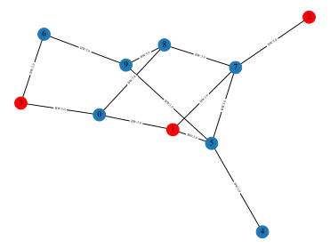

# ChainXim User Guide
[中文](README.zh.md) | English

## Introduction
ChainXim is a blockchain simulator developed by XinLab for simulating and validating blockchain systems. While decentralization is a core feature of blockchain systems, it often leads to significant costs and engineering challenges in simulating and testing large-scale blockchain networks. ChainXim provides a novel solution for low-cost, large-scale blockchain deployment and testing, while also serving as a development foundation for blockchain applications.

ChainXim can deploy a large-scale blockchain networks on a single machine, simulating node operations and interactions within a virtual environment. When the main chain reaches a predetermined block height, the environment terminates the simulation loop and generates performance reports. Beyond performance evaluation, ChainXim can simulate attackers' behaviors to test blockchain robustness against potential attack vectors and verify the security properties of consensus protocols. The multiple network models in ChainXim simulate propagation characteristics of messages in blockchain systems, and ChainXim supports both real-world topology-based networks and abstract network models stemming from theoretical blockchain research. This capability bridges theoretical studies with simulation outcomes, facilitating the development and optimization of new blockchain systems.

Built upon Bitcoin Backbone Protocol, ChainXim features a highly extensible architecture. Its consensus layer theoretically supports diverse consensus protocols through modular implementations that can be integrated easily into the simulator. While configuring the five major network models can achieve desired network-layer behaviors, the network layer also allows developers to create new models using its message-passing framework and network interface, thereby expanding simulation scenarios. The attack layer leverages unified interfaces in miner modules to leverage consensus-layer and network-layer capabilities for executing various network attacks. Post-simulation evaluation modules calculate critical performance metrics including throughput, fork rate, and chain quality, each provides valuable insights into blockchain system's security and performance.


## ChainXim-Based Projects

- BagChain: A Dual-functional Blockchain Leveraging Bagging-based Distributed Learning. [Source Code](https://github.com/czxdev/BagChain)

  BagChain integrates blockchain with distributed machine learning by replacing the computationally costly hash operations in proof-of-work with machine-learning model training. It utilizes individual miners’ private data samples and limited computing resources to train base models and further aggregates them into strong ensemble models. A three-layer blockchain structure and the corresponding generation and validation mechanisms are designed to enable distributed machine learning among uncoordinated miners in a permissionless and open setting.


## Quick Start
### Download


You can clone the Github repository with git.

Git clone command: `git clone https://github.com/ChainXim-Team/ChainXim.git`

Or you can download the master branch from the ChainXim code repository: [master.zip](https://github.com/ChainXim-Team/ChainXim/archive/refs/heads/master.zip)

<details markdown>
<summary> File Structure </summary>

The file structure after extracting the zip file or cloning the repository is as follows:

```
chain-xim
├── attack
│   ├── _adversary.py
│   ├── adversary.py
│   ├── attack_type
│   │   ├── _atomization_behavior.py
│   │   ├── atomization_behavior.py
│   │   ├── attack_type.py
│   │   ├── double_spending.py
│   │   ├── eclipse_alpha.py
│   │   ├── eclipsed_double_spending.py
│   │   ├── eclipsed_double_spending_research_backup.py
│   │   ├── eclipse_network_cutting.py
│   │   ├── honest_mining.py
│   │   ├── __init__.py
│   │   └── selfish_mining.py
│   └── __init__.py
├── conf
│   └── topologies
│       ├── circular16_coo.csv
│       ├── default_adj.csv
│       └── ...
│   └── ...
├── consensus
│   ├── consensus_abc.py
│   ├── __init__.py
│   ├── pow.py
│   ├── solidpow.py
│   └── virtualpow.py
│   ├── ...
├── data
│   ├── block.py
│   ├── chain.py
│   ├── __init__.py
│   └── message.py
├── developer-guide.en.md
├── developer-guide.zh.md
├── environment.py
├── errors.py
├── external.py
├── functions.py
├── global_var.py
├── main.py
├── miner
│   ├── _consts.py
│   ├── __init__.py
│   ├── miner.py
│   └── network_interface
│       ├── __init__.py
│       ├── nic_abc.py
│       ├── nic_without_tp.py
│       └── nic_with_tp.py
├── network
│   ├── adhoc.py
│   ├── deterprop.py
│   ├── __init__.py
│   ├── network_abc.py
│   ├── stochprop.py
│   ├── synchronous.py
│   ├── topology.py
├── README.md
├── README.zh.md
├── requirements.txt
├── simulation-example.en.md
├── simulation-example.zh.md
├── system_config.ini
```

| File or Directory         | Description                                        |
| -------------------------- | -------------------------------------------------- |
| main\.py                   | Main program of the simulator                      |
| system_config\.ini         | Configuration file                                 |
| README.md                  | User documentation                                 |
| environment\.py            | Environment class and related functions            |
| miner/                     | Directory containing miner classes and network interfaces |
| data/                      | Directory containing Message, BlockHead, Block, Chain classes and related functions |
| consensus/                 | Directory containing abstract consensus classes, PoW classes, and related functions |
| network/                   | Directory containing various network classes       |
| attack/                    | Attacker class and related functions               |
| functions\.py              | Functions including SHA256 hash calculation        |
| external\.py               | External functions for blockchain statistics |
| errors\.py                 | Error classes for throwing errors in the simulator |
| global_var\.py             | Global variables                                   |

</details>

### Environment Setup
1. Install Anaconda. [Anaconda download link](https://www.anaconda.com/download)
2. Open Anaconda Prompt from the Start menu.
3. Create a conda environment and activate it, choosing Python version 3.10.
```
conda create -n chainxim python=3.10 python-graphviz
activate chainxim
```
4. Install the required packages via pip.
```
cd <project_directory>
pip install -r requirements.txt
```

### Simple Startup
1. Open Anaconda Prompt from the Start menu, and activate the conda environment before running.
```
activate chainxim
```
2. Run the main program in the ChainXim root directory.
```
cd <project_directory>
python main.py
```

## An Example for Beginners
ChainXim is a discrete-time simulator that iteratively simulates the behaviors of miners and attackers by "rounds". In this example, a randomly generated network consisting of 10 nodes will be created. This network includes two attackers, who attempt to maximize their mining rewards by inserting as many blocks as possible into the main chain through selfish mining strategies. By passing the following parameters to the main program, the simulation will start and run for 3000 rounds.
```
python main.py --total_round 3000 --miner_num 10 --average_block_time 400 --network_type network.TopologyNetwork --attack_type SelfishMining --blocksize 8 --no_compact_outputfile --show_label
```
After the simulation starts, it will output the simulation parameters and display a progress bar during the simulation.
```
Network Attributes
    miner_num: 10
    Generate Approach: adj
    Generate Edge Probability: None
    Diameter: 4
    Average Shortest Path Length: 2.067
    Degree Histogram: [0, 2, 2, 4, 2]
    Average Degree: 2.6
    Average Cluster Coefficient: 0.067
    Degree Assortativity: -0.2


Parameters:
Miner Number: 10 
Consensus Protocol: PoW 
Network Type: TopologyNetwork 
Network Param:  {'show_label': True, 'save_routing_graph': False, 'save_routing_history': True, 'dynamic': False, 'enable_resume_transfer': True, 'ave_degree': 5.0, 'bandwidth_honest': 5.0, 'bandwidth_adv': 5.0, 'outage_prob': 0.0, 'avg_tp_change_interval': 10.0, 'edge_add_prob': 0.1, 'edge_remove_prob': 0.05, 'max_allowed_partitions': 1.0, 'init_mode': 'adj', 'stat_prop_times': [0.03, 0.05, 0.08, 0.1, 0.2, 0.4, 0.5, 0.6, 0.7, 0.8, 0.9, 0.93, 0.95, 0.98, 1.0], 'rand_mode': 'binomial'} 
Consensus Param: {'target': '0010624dd2f1a9fc000000000000000000000000000000000000000000000000', 'q_ave': 1.0, 'q_distr': 'equal'} 
Adversary Miners: [1, 2, 3] 
Attack Execute Type: SelfishMining  (Adversary's q: 3.0) 
Block Size: 8.0
```
After the simulation ends, the simulation results will be shown:

```
Chain Growth Property:
9 blocks are generated in 3000 rounds, in which 0 are stale blocks.
Average chain growth in honest miners' chain: 9.0
Number of Forks: 0
Fork rate: 0.0
Stale rate: 0.0
Average block time (main chain): 333.33333333 rounds/block
Average block time (total): 333.33333333 rounds/block
Block throughput (main chain): 0.003 blocks/round
Throughput in MB (main chain): 0.024 MB/round
Block throughput (total): 0.003 blocks/round
Throughput in MB (total): 0.024 MB/round

Chain_Quality Property: {'Honest Block': 10, 'Adversary Block': 0}
Ratio of blocks contributed by malicious players: 0.0
The simulation data of SelfishMining is as follows :
 {'The proportion of adversary block in the main chain': 'See [Ratio of blocks contributed by malicious players]', 'Theory proportion in SynchronousNetwork': '0.2731'}
Double spending success times: 0
Block propagation times: {0.03: 0, 0.05: 0, 0.08: 0, 0.1: 0, 0.2: 1.111, 0.4: 2.0, 0.5: 2.556, 0.6: 3.727, 0.7: 3.667, 0.8: 4.308, 0.9: 4.769, 0.93: 0, 0.95: 0, 0.98: 0, 1.0: 5.0}
Count of INV interactions: 267
```

For detailed explanation of the metrics in the output, refer to [Simulator Output](developer-guide.en.md#Simulator-Output). In addition, various data generated during the simulation will be saved in the Results folder, including each miner's blockchain records, blockchain visualization graphics, blockchain attacker logs, routing history, network topology, block propagation diagrams, etc. The following are the examples of some output figures.

-----
Blockchain visualization graphic ([blockchain_visualization/Blockchain Structure.gv.svg](doc/Blockchain-Structure.svg))
<br><br/>


<br><br/>
Red blocks in the figure are generated by attackers, and blue blocks are generated by honest miners.

-----
Network topology diagram ([Network Results/network topology.svg](doc/network-topology.svg))



The transmission bandwidth between adjacent nodes is marked in the figure, with the unit being MB/round.

## Simulation Examples
See [Featured Examples](simulation-example.en.md) for more details


## Developer's Document
See [Developer Guide](developer-guide.en.md) for more details


## Contributors
曹苇杭 Weihang Cao

* Designed and developed the consensus layer and the evaluation layer

陈炳文 Bingwen Chen

* Designed and developed the network layer, including the development of NetworkInterface and all network models

陈阳 Yang Chen

* Designed and developed the attack layer, including the development of all attack types

崔自翔 Zixiang Cui

* Optimized performance, refined ChainXim framework, and implemented the DataItem mechanism

陈喜年 Xinian Chen

* Optimized perfermance and tested ChainXim

凌昕彤 Xintong Ling

* Advisor