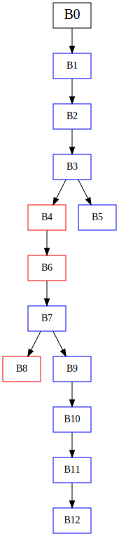

# ChainXim 用户指南 User Guide
中文 | [English](README.md)
## 简介 Introduction

ChainXim是一款由XinLab开发的区块链仿真器，用于对区块链系统进行仿真验证。区块链系统以去中心化为核心特征，但这一特征通常导致大规模区块链网络的模拟与测试存在较大的成本与工程上的困难。ChainXim为低成本、大规模的区块链部署与测试提供了一种新的解决方案，并可充当区块链应用的开发基座。

ChainXim可以支持单机部署大规模的区块链网络，在一个虚拟环境中模拟区块链中各节点的运作与交互，并在环境检测到主链达到预定的区块高度后停止仿真并导出性能报告。除了性能评估外，ChainXim还可以模拟攻击者行为，从而测试区块链在潜在攻击向量下的稳健性，检验共识协议的安全特性。ChainXim目前通过五种不同网络模型以模拟网络传播特性，并同时支持基于拓扑的真实网络以及与现有区块链理论研究中的抽象网络模型，使得理论与仿真结果可以匹配，从而充当区块链理论与工程实践间的一座桥梁，促进新区块链系统的开发与优化。

ChainXim以Bitcoin Backbone Protocol为理论基础构建，架构高度可扩展，理论上共识层支持各类共识协议，可以将协议实现为单独模块后插入到ChainXim中进行仿真。除了配置现有五大网络模型以获得预期的网络层行为，网络层亦可在消息传递框架与网络接口上开发新的网络模型，从而为ChainXim扩展更多的网络场景。攻击层可以通过矿工模块中的统一接口调用共识层与网络层中的能力对区块链实施多种网络攻击。环境中的评估模块会在仿真结束后计算吞吐量、分叉率、链质量等性能指标。


## 基于ChainXim的项目 ChainXim-Based Projects

- BagChain: A Dual-functional Blockchain Leveraging Bagging-based Distributed Learning. [Source Code](https://github.com/czxdev/BagChain)


## Quick Start
### 下载 Download


可以下载ChainXim的压缩包后解压，或者克隆位于Gitee上的软件仓库

可在ChainXim的代码仓库下载master分支的压缩包：[master.zip](https://github.com/ChainXim-Team/ChainXim/archive/refs/heads/master.zip)

git克隆命令：`git clone https://github.com/ChainXim-Team/ChainXim.git`

<details markdown>
<summary> 文件结构 </summary>

压缩包解压后或软件仓库克隆后的文件结构如下：

```
chain-xim
├── attack
│   ├── _adversary.py
│   ├── adversary.py
│   ├── attack_type
│   │   ├── _atomization_behavior.py
│   │   ├── atomization_behavior.py
│   │   ├── attack_type.py
│   │   ├── double_spending.py
│   │   ├── eclipse_alpha.py
│   │   ├── eclipsed_double_spending.py
│   │   ├── eclipsed_double_spending_research_backup.py
│   │   ├── eclipse_network_cutting.py
│   │   ├── honest_mining.py
│   │   ├── __init__.py
│   │   └── selfish_mining.py
│   └── __init__.py
├── conf
│   └── topologies
│       ├── circular16_coo.csv
│       ├── default_adj.csv
│       └── ...
│   └── ...
├── consensus
│   ├── consensus_abc.py
│   ├── __init__.py
│   ├── pow.py
│   ├── solidpow.py
│   └── virtualpow.py
│   ├── ...
├── data
│   ├── block.py
│   ├── chain.py
│   ├── __init__.py
│   └── message.py
├── developer-guide.en.md
├── developer-guide.zh.md
├── environment.py
├── errors.py
├── external.py
├── functions.py
├── global_var.py
├── main.py
├── miner
│   ├── _consts.py
│   ├── __init__.py
│   ├── miner.py
│   └── network_interface
│       ├── __init__.py
│       ├── nic_abc.py
│       ├── nic_without_tp.py
│       └── nic_with_tp.py
├── network
│   ├── adhoc.py
│   ├── deterprop.py
│   ├── __init__.py
│   ├── network_abc.py
│   ├── stochprop.py
│   ├── synchronous.py
│   ├── topology.py
├── README.md
├── README.zh.md
├── requirements.txt
├── simulation-example.en.md
├── simulation-example.zh.md
├── system_config.ini
```

| 文件或目录 | 功能描述 |
| -------- | -------- |
| main\.py  | 仿真器主程序 |
| system_config\.ini | 配置文件 |
| README.md | 用户文档 |
| environment\.py | 环境类与相关函数 |
| miner/ | 存放矿工类与网络接口 |
| data/ | 存放Mesage、BlockHead、Block、Chain类与相关函数 |
| consensus/ | 存放抽象共识类、PoW类与相关函数的目录 |
| network/ | 存放多种网络类的目录 |
| attack/ | 攻击者类与相关函数 |
| functions\.py | 包含计算哈希（SHA256）在内的一些函数 |
| external\.py | 一些用于统计区块链指标的外部函数 |
| errors\.py | 错误类，用于在仿真器中抛出错误 |
| global_var\.py | 存放全局变量 |

</details>

### 配置环境 Environment Setup
1. 安装Anaconda。[Anaconda下载链接](https://www.anaconda.com/download)
2. 从开始菜单打开Anaconda Prompt。
3. 生成一个conda环境并激活，Python版本选择3.10。
```
conda create -n chainxim python=3.10 python-graphviz
activate chainxim
```
4. 在ChainXim的根目录下通过pip安装所需要的包。
```
cd <project_directory>
pip install -r requirements.txt
```

### 简单运行 Simple Startup
1. 从开始菜单打开Anaconda Prompt，运行前需要激活conda环境。
```
activate chainxim
```
2. 在ChainXim的根目录下运行主程序。
```
cd <project_directory>
python main.py
```


## 测试用例 An Example for Beginners
ChainXim是一个离散时间仿真器，以“轮次”为基本单位迭代进行矿工与攻击者行为的仿真。在这个测试用例中，将随机生成一个包含10个节点的网络，其中有两个攻击者，它们通过自私挖矿手段，意图在主链上插入尽可能多的块以最大化挖矿收益。将以下参数传递给主程序可以直接开始执行这个测试用例，仿真将总共持续3000轮次。
```
python main.py --total_round 3000 --miner_num 10 --average_block_time 400 --network_type network.TopologyNetwork --attack_type SelfishMining --blocksize 8 --no_compact_outputfile --show_label
```
仿真开始后会输出仿真参数，并在仿真进行时显示进度条。
```
Network Attributes
    miner_num: 10
    Generate Approach: adj
    Generate Edge Probability: None
    Diameter: 4
    Average Shortest Path Length: 2.067
    Degree Histogram: [0, 2, 2, 4, 2]
    Average Degree: 2.6
    Average Cluster Coefficient: 0.067
    Degree Assortativity: -0.2


Parameters:
Miner Number: 10 
Consensus Protocol: PoW 
Network Type: TopologyNetwork 
Network Param:  {'show_label': True, 'save_routing_graph': False, 'save_routing_history': True, 'dynamic': False, 'enable_resume_transfer': True, 'ave_degree': 5.0, 'bandwidth_honest': 5.0, 'bandwidth_adv': 5.0, 'outage_prob': 0.0, 'avg_tp_change_interval': 10.0, 'edge_add_prob': 0.1, 'edge_remove_prob': 0.05, 'max_allowed_partitions': 1.0, 'init_mode': 'adj', 'stat_prop_times': [0.03, 0.05, 0.08, 0.1, 0.2, 0.4, 0.5, 0.6, 0.7, 0.8, 0.9, 0.93, 0.95, 0.98, 1.0], 'rand_mode': 'binomial'} 
Consensus Param: {'target': '0010624dd2f1a9fc000000000000000000000000000000000000000000000000', 'q_ave': 1.0, 'q_distr': 'equal'} 
Adversary Miners: [1, 2, 3] 
Attack Execute Type: SelfishMining  (Adversary's q: 3.0) 
Block Size: 8.0
```
仿真结束后将输出仿真结果：

```
Chain Growth Property:
9 blocks are generated in 3000 rounds, in which 0 are stale blocks.
Average chain growth in honest miners' chain: 9.0
Number of Forks: 0
Fork rate: 0.0
Stale rate: 0.0
Average block time (main chain): 333.33333333 rounds/block
Average block time (total): 333.33333333 rounds/block
Block throughput (main chain): 0.003 blocks/round
Throughput in MB (main chain): 0.024 MB/round
Block throughput (total): 0.003 blocks/round
Throughput in MB (total): 0.024 MB/round

Chain_Quality Property: {'Honest Block': 10, 'Adversary Block': 0}
Ratio of blocks contributed by malicious players: 0.0
The simulation data of SelfishMining is as follows :
 {'The proportion of adversary block in the main chain': 'See [Ratio of blocks contributed by malicious players]', 'Theory proportion in SynchronousNetwork': '0.2731'}
Double spending success times: 0
Block propagation times: {0.03: 0, 0.05: 0, 0.08: 0, 0.1: 0, 0.2: 1.111, 0.4: 2.0, 0.5: 2.556, 0.6: 3.727, 0.7: 3.667, 0.8: 4.308, 0.9: 4.769, 0.93: 0, 0.95: 0, 0.98: 0, 1.0: 5.0}
Count of INV interactions: 267
```

各输出项的详细解释可以参考[仿真器输出](developer-guide.zh.md#仿真器输出-Simulator-Output). 此外，仿真过程中产生的各类数据将保存在Results文件夹，包括每个矿工的区块链记录、区块链可视化矢量图、区块链攻击者日志、路由历史、网络拓扑图、区块传播示意图等。以下是仿真器输出的部分图像的样例。

-----
区块链可视化矢量图（[blockchain_visualization/Blockchain Structure.gv.svg](doc/Blockchain-Structure.svg)）
<br><br/>


<br><br/>

图中红色区块由攻击者产生，蓝色区块由诚实矿工产生。

-----
网络拓扑图（[Network Results/network topology.svg](doc/network-topology.svg)）


图中相邻节点之间标记了传输带宽，单位为MB/round。


## 精选示例 Featured Examples
详见[精选示例 Featured Examples](simulation-example.zh.md)


## 开发者文档 Developer Guide
详见[开发者文档 Developer Guide](developer-guide.zh.md)


## 贡献者 Contributors
曹苇杭 Weihang Cao

* 主要负责共识层与评估层的设计与代码编写

陈炳文 Bingwen Chen

* 主要负责网络层的设计与代码编写，包括全部网络模型以及网络接口的开发

陈阳 Yang Chen

* 主要负责攻击层的设计与代码编写，包括全部攻击类型的开发

崔自翔 Zixiang Cui

* 主要负责优化性能、改进ChainXim框架并实现了DataItem机制

陈喜年 Xinian Chen

* 主要负责ChainXim的测试与优化   

凌昕彤 Xintong Ling

* 指导老师
