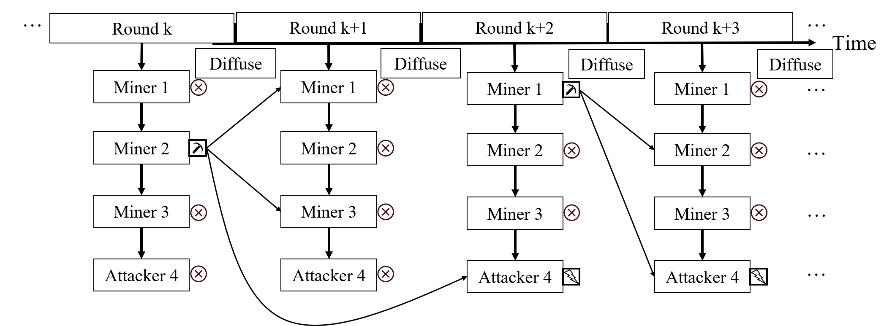
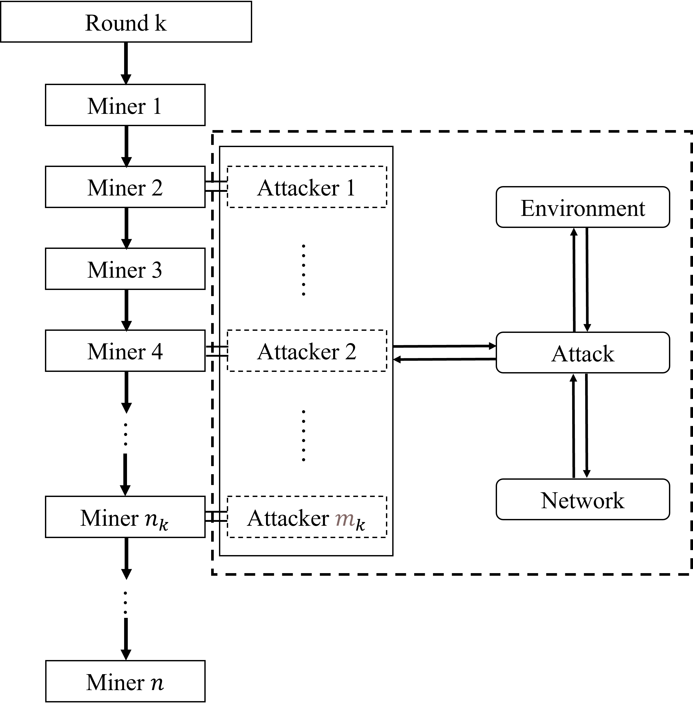

# ChainXim 开发者文档

## 总体架构
ChainXim主要由Environment、Miner、Adversary、Network、Consensus、Blockchain六个组件组成，其中Consensus、Adversary与Network三大组件可配置、可替换，从而适应不同类型的共识协议、攻击向量与网络模型。六个抽象组件之间的关系如下图所示：


每个抽象组件由对应的一个或多个类实现，其中Consensus对应的Consensus类以及Network对应的Network类仅为抽象类，还需要派生出有实际功能的类，以实现各类共识协议与网络模型。

目前已实现的共识协议（目前consensus_type配置的所有可选项）：

| 共识类(派生自Consensus) | 说明           |
| ----------------------- | -------------- |
| consensus.PoW           | 工作量证明机制 |

目前已实现的网络模型（目前network_type配置的所有可选项）：

| 网络类(派生自Network)       | 说明                                       |
| --------------------------- | ------------------------------------------ |
| network.SynchronousNetwork  | 同步网络模型                               |
| network.PropVecNetwork      | 基于传播向量的网络模型                     |
| network.BoundedDelayNetwork | 延迟有界、接收概率随轮次增加递增的网络模型 |
| network.TopologyNetwork     | 复杂拓扑网络模型，可以生成随机网络         |

Environment是仿真器的核心。用户执行main.py中的主程序开始仿真。主程序根据仿真参数初始化Environment对象，调用`exec`启动仿真循环，仿真结束后调用`view_and_write`生成仿真结果并写入Results文件夹。

ChainXim将时间离散化处理，抽象为“轮次”（round），以轮次为单位模拟每个节点的行为。每个轮次依次激活矿工节点执行共识操作，所有节点都被激活一遍之后，调用网络类中的`diffuse`方法在矿工节点间进行消息传输。(详见**环境与模型假设**章节)


## 环境与模型假设 Environment
Environment组件是ChainXim程序运行的基石，其主要完成了仿真器系统模型的架构，以便与其它五大组件进行对接。同时也定义了仿真器中主要的一些参量，并封装了仿真器各组件中需要运用的部分函数。为便于理解该部分内容，下面将首先介绍ChainXim的模型假设。
### 模型假设
ChainXim的系统模型设计主要参考了下面的论文：
* J. A. Garay, A. Kiayias and N. Leonardos, "The bitcoin backbone protocol: Analysis and applications", Eurocrypt, 2015. <https://eprint.iacr.org/2014/765.pdf>

ChainXim将连续的时间划分为一个个离散的轮次，且网络中的全部节点（包含诚实矿工与非诚实攻击者）都将在每个轮次内进行一定数目的操作，以完成记账权的竞争与新区块的生成与传播。定义网络中矿工总数为n，其中有t个矿工隶属于非诚实的攻击者。每个轮次中，全体矿工根据各自的编号被依次唤醒，并根据自己的身份采取行动，诚实矿工将严格依照共识协议的规则产生区块；攻击者则会结合实际情况选择遵守协议或发起攻击。**注意，每个轮次中，攻击模块只会被触发一次，每次触发都会进行一次完整的攻击行为。当前版本中，攻击者每轮次中会随机在轮到某一个隶属于攻击者的矿工时触发。虽然不同矿工被唤醒的次序不同，但同一轮次内实际上不存在先后顺序。** 

为模拟上述各方在现实区块链系统中的具体操作，ChainXim参考了论文中提出的两种重要方法，它们分别为随机预言（Random Oracle）和扩散（Diffuse）方法，其在ChainXim中的具体定义如下：
- **随机预言（Random Oracle）**：以PoW共识为例，各矿工在每一轮次最多可执行q次行动（不同矿工的q可能为不同值），即q次进行哈希计算的机会。每个矿工都将进行q次随机查询操作，即将某一随机数输入哈希函数，验证其结果是否小于给定难度值。若矿工成功找到了低于难度值的结果，则视为其成功产生了一个区块。**同一轮次中不同矿工产生的区块视作是同时产生的。**
- **扩散（Diffuse）**：当矿工产生了新的区块，它会将这个区块上传到网络，由网络层负责消息传播。根据网络层配置的不同，传播逻辑也会有所不同。此外，攻击者也可能选择不上传自己本轮次挖到的区块，只有上传到网络层的区块才会经由该方法进行传播。**在ChainXim的模型中，认为攻击者所控制的矿工拥有独立于区块链系统的专用通信通道，即任一隶属于攻击者的矿工一旦接收到某个区块，则攻击者麾下的所有矿工均会在下一轮次收到该区块。**

**注意，上述的扩散方法主要与Network组件对接，而随机预言方法则与Consensus组件对接。随即预言建模最初是针对比特币中的的PoW共识协议提出的。为使仿真器能够兼容其它共识，例如PBFT这类基于交互的共识，ChainXim后续将考虑在Consensus组件中对这一方法进行重载。**
**Environment中设置了exec函数来一次性完成上述两种方法**：每一轮次中，所有矿工将依次被唤醒，并各自执行随机预言方法：如果矿工为诚实方，那么exec函数将调用Consensus组件执行进行相关操作；如果激活了攻击者，则调用Attacker组件进行相关操作。（每一轮次中只会调用一次Attacker组件）
当所有矿工都完成自己的行动，即回合结束时，exec函数中将执行Network组件中的扩散方法，在网络中传播区块。一个具体的实例如下图所示：



该实例中n=4，t=1。当第k轮次（Round k）开始时，四个矿工将依照序号从小到大的顺序被依次唤醒，且各自完成自己的q次行动。其中，仅有2号矿工（Miner 2）成功获得了记账权，并将产生的区块进行传播（Diffuse方法）。由于各自的传播时延不尽相同，1号矿工与3号矿工在第k+1轮次便已成功接收到了该区块，而4号矿工则到第k+2轮次才收到此区块。第k+1轮次没有矿工完成出块，第k+2轮次中1号与4号矿工则都完成了出块，但这里4号矿工为攻击者，它采取了自私挖矿的攻击手段，将随机预言中产生的区块置于私链上，在扩散中也暂不传播给其它矿工。第k+3轮次中只有4号攻击者矿工完成出块，这时在它的视野中，自己的私链已经长于主链，故它会将私链通过扩散方法传播给其它矿工，区块链至此发生分叉，且在收到该私链矿工的视野中，攻击者的链为最长合法链。第k+4轮次中，如果1号或2号矿工没有收到私链，并继续在诚实主链上挖矿，则它们的利益将可能受到损害。

综上所述，ChainXim利用离散的轮次与受限的行动次数有效抽象了区块链网络中区块的产生与传播。

### 仿真器环境
总体来说，环境组件完成了整体模型的搭建。初始化函数根据输入参数设置基础参数，调用了其它组件进行各自的初始化，设置n个矿工、选定t个攻击者、配置全局区块链、网络组件、攻击组件等，用于后续运行与评估。环境组件中的主要函数及其各自的参数如下表所示：
| 函数 | 参数 | 说明 |
| -------- | -------- | -------- |
|select_adversary_random|-|随机选取一定数量的矿工作为攻击者|
|select_adversary|\*Miner_ID:tuple|通过输入指定ID，设置相应矿工为攻击者|
|envir_create_global_chain|-|创建环境中的全局区块链|
|attack_excute|round:int|执行attack中定义的攻击类型|
|exec|num_rounds:int, max_height:int, process_bar_type:str|执行指定轮数或指定高度的仿真，通过num_rounds设置仿真运行的总轮数，通过max_height设置仿真终止的高度|
|assess_common_prefix|-|计算评估区块链的共同前缀特性|
|assess_common_prefix_k|-|优化的计算评估共同前缀的方法|
|view|-|在终端窗口输出仿真结果，包含仿真生成的区块链结构图、吞吐量、增长率(反映链增长)、分叉率及共同前缀与链质量评估|
|view_and_write|-|输出仿真结果并保存在txt文件中|
|process_bar|-|显示当前仿真的进度，在终端输出实时变动的进度条与百分比|

上表中，envir_create_global_chain初始化生成了一条全局区块链。此后，该链将作为上帝视角下的全局区块链树与全局最长合法链。
主程序根据仿真参数初始化Environment对象，调用`exec`启动仿真循环，实现了论文中所述的随机预言方法与扩散方法,对于攻击者则需通过`attack_excute`调用相应接口。仿真结束后调用`view_and_write`统计并输出仿真结果。


## 矿工 Miner
Miner组件定义了矿工类，用于创建矿工并进行相关的操作。其中定义的函数如下表所示：
| 函数 | 输入参数与类型 | 返回值类型 |说明 |
| -------- | -------- |-------- |  ---------- |
|set_adversary|isAdversary:bool|-|设置各矿工是否为攻击者|
|receive|msg:message|bool|处理接收的信息，实际为调用consensus组件中的receive方法|
|launch_consensus|input:any|Block\|None, bool|开始共识过程，实际为调用consensus组件中的consensus_process方法，返回新消息new_msg（没有新消息则为None）以及是否有新消息的标识符msg_available|
|BackboneProtocol|round:int|Block\|None|诚实矿工每轮次执行的操作。首先从网络中接收信息（区块链更新），其次调用挖矿函数尝试生成区块。如果区块链有更新（接收到新区块或产生了新区块），则将新消息返回给环境组件，否则返回空|

考虑到仿真器的拓展性，miner组件自身定义的函数实际是很少的，主要的函数都在consensus组件与environment组件中定义，该组件实际上为联系各组件的桥梁。

## 区块链数据 Chain Data
本节介绍ChainXim中的基础数据类型。在仿真过程中产生的所有区块数据通过chain.py中定义的BlockHead、Block、Chain类描述。下图为ChainXim中区块链数据结构的示意图。所有Block以多叉树形式组织起来，树上的每一对父节点与子节点通过Block中的last与next属性双向链接，树的根节点与末端节点分别记录于Chain.head以及Chain.lastblock。图中Chain对象包含高度为2的区块链，除创世区块`Block 0`以外，共有三个区块，在区块高度1处出现分叉，`Block 0 - Block 1 - Block 3`构成主链，`Block 3`是主链的链尾。


### BlockHead

BlockHead用于定义区块头中的数据，在chain.py中定义的BlockHead为抽象基类，其calculate_blockhash为抽象方法，需要在共识类中定义新的BlockHead并覆盖calculate_blockhash。BlockHead仅包含下表中的属性：

| 属性      | 类型 | 说明                                                         |
| --------- | ---- | ------------------------------------------------------------ |
| prehash   | str  | 前一区块的哈希                                               |
| timestamp | int  | 创建区块时的时间戳                                           |
| content   | Any  | 区块中承载的数据，在实际系统中一般为交易信息或Merkle Root，但在本仿真器中为产生区块的轮次 |
| miner     | int  | 产生区块的矿工或攻击者的ID                                   |

**注：由于本仿真器更加关心区块在网络中的传播情况，因此，对于区块链中存储的数据（交易，智能合约等），使用content属性对其进行抽象。在代码实现中，content被赋值为区块产生的轮次。**

### Block

Block用于定义区块中的数据，除了区块头blockhead以外，还包含下表中的属性：

| 属性             | 类型        | 说明                                                 |
| ---------------- | ----------- | ---------------------------------------------------- |
| name             | str         | 区块的friendly name，格式为字母B+一个标识区块产生顺序的序号 |
| height           | int         | 区块高度                                             |
| blockhash        | str         | 区块被构建时自动计算出的区块哈希                     |
| isAdversaryBlock | bool        | 是否是攻击者产生的区块                               |
| isGenesis        | bool        | 是否是创世区块                                       |
| next             | list[Block] | 一个引用子块的列表                                   |
| last             | Block       | 对母块的引用                                         |

**需要注意的是，blockhead属性为只读属性，Block对象被构造后便不可修改。** 除此以外Block具有两个辅助方法：

| 方法                | 输入参数与类型 | 返回值类型 | 说明                                                         |
| ------------------- | -------------- | ---------- | ------------------------------------------------------------ |
| BlockHeight         | -              | int        | 返回Block.height                                             |
| calculate_blockhash | -              | str        | 调用blockhead.calculate_blockhash，保存哈希值于blockhash并返回blockhash的值 |

最后，为了使Block对象能够在Network中传输，Block类派生自Message类。

### Chain

Chain主要用于保存区块链的根节点与末端节点，并定义操作区块链所需的一系列函数。Chain包含下表中的属性：

| 属性      | 说明                                                |
| --------- | --------------------------------------------------- |
| head      | 储存区块链的创世区块                                |
| lastblock | 对主链末端区块的引用，对于PoW系统主链为多叉树上的最长链 |
| miner_id  | 维护区块链的矿工或攻击者的ID，如为全局区块链则为缺省值None            |

Chain类具有多种方法，可以用于添加新区块、合并链、搜索区块、可视化区块链、保存区块链数据等，见下表：

| 方法                            | 输入参数与类型                            | 返回值类型  | 说明                                                         |
| ------------------------------- | ----------------------------------------- | ----------- | ------------------------------------------------------------ |
| search                          | block: Block, searchdepth: int            | Block\|None | 从主链上高度为lastblock.height-searchdepth的区块开始遍历整个多叉树搜索block，如果搜索到则返回Block对象，否则返回None |
| search_chain                    | block: Block, searchdepth: int            | Block\|None | 在主链上从lastblock向创世区块方向搜索block，如果搜索到则返回Block对象，区块高度低于lastblock.height-searchdepth之后停止搜索并返回None |
| last_block                      | -                                         | Block       | 返回Chain.lastblock                                          |
| add_block_direct                | block: Block                              | Block       | 将block直接添加到主链末尾，并将lastblock指向block，返回block |
| insert_block_copy               | copylist:List[Block], insert_point: Block | Block\|None | 在指定的插入点insert_point将copylist中指定的区块合入多叉树，返回合并后链末端的区块，如果没有合并返回None |
| add_block_copy                  | lastblock:Block                           | Block\|None | 合并lastblock所在的链，返回合并后链末端的区块，如果没有合并返回None |
| ShowStructure1                  | -                                         | -           | 以head为根节点，在stdout打印整个多叉树                       |
| ShowStructure                   | miner_num:int                                | -           | 生成blockchain visualisation.svg，显示区块链中每个区块产生的轮次以及父子关系 |
| ShowStructureWithGraphviz       | -                                         | -           | 在blockchain_visualization目录下借助Graphviz生成区块链可视化图 |
| get_block_interval_distribution | -                                         | -           | 生成出块时间分布图block interval distribution.svg          |
| printchain2txt                  | chain_data_url:int                        | -           | 将链中所有块的结构与信息保存到chain_data_url，默认保存到'Chain Data/chain_data.txt' |
| CalculateStatistics             | rounds:int                                | dict        | 生成区块链统计信息，通过字典返回统计信息，rounds为仿真总轮次数 |

**注：有关区块链中区块拷贝的方法，有浅拷贝（add_block_direct）和深拷贝（insert_block_copy、add_block_copy）两种，分别适用于矿工生成新的区块和从其他矿工处接收到区块的情况**


## 共识 Consensus
本节介绍ChainXim的共识层架构，以工作量证明（Proof of Work, PoW）为例解释共识协议在ChainXim中的实现。Consensus类是一个描述ChainXim共识层基本要素的抽象类，在ChainXim中实现共识协议需要在Consensus类基础上扩展出新的共识类。目前已经实现的共识类是PoW，下图为展现PoW与Consensus关系的类图。


每一个PoW对象包含以下属性：

| 属性         | 类型  | 说明                                                         |
| ------------ | ----- | ------------------------------------------------------------ |
| Blockchain   | Chain | 本地链，是某一矿工视角下的区块链，包含主链以及所有该矿工已知的分叉 |
| receive_tape | list  | 接收队列，区块到达矿工时被添加到接收队列中，矿工的回合结束后清空队列 |
| target       | str   | PoW中哈希计算问题的目标值，当且仅当区块哈希值小于该目标值，区块有效 |
| q            | int   | 单个矿工每轮次可计算哈希次数                                 |

PoW类通过以下方法模拟工作量证明机制中的出块、验证行为，并通过最长链原则解决分叉：

| 方法             | 输入参数与类型                               | 返回值类型                   | 说明                                                         |
| ---------------- | -------------------------------------------- | ---------------------------- | ------------------------------------------------------------ |
| mining_consensus | miner_id:int,<br>isadversary:bool,<br>x: Any | Block, bool \|<br>None, bool | 每个轮次执行一次，修改q次nonce计算区块哈希，<br>如果哈希小于目标值，返回Block对象和True，<br>否则返回None和False |
| maxvalid         | -                                            | Block, bool                  | 逐一验证receive_tape中的区块，将区块合并到本地链中，<br>最后通过最长链准则确定主链，<br>返回主链的链尾以及一个反映主链是否被更新的标志 |
| valid_chain      | lastblock: Block                             | bool                         | 验证末端为lastblock的链                                      |
| valid_partial    | lastblock: Block                             | list[Block], Block           | 用于优化maxvalid的函数，降低区块合并的时间复杂度             |
| valid_block      | block: Block                                 | bool                         | 验证block是否有效，即验证区块哈希是否小于目标值                                |

### 共识协议与区块

下图展示了Chainxim中与共识相关的继承与派生关系。如图所示，PoW.BlockHead与PoW.Block类是共识类的子类，派生自chain.py中定义的BlockHead与Block类。Consensus类的子类BlockHead与Block类分别继承自chain.py中的BlockHead与Block，并重新定义了BlockHead与Block的初始化接口。


Consensus.BlockHead与Consensus.Block通过如下接口初始化。

```python
# consensus/consensus_abc.py
class Consensus(metaclass=ABCMeta):
    class BlockHead(chain.BlockHead):
        def __init__(self, preblock:chain.Block=None, timestamp=0, content=0, miner_id=-1):
    
    class Block(chain.Block):
        def __init__(self, blockhead: chain.BlockHead, preblock: chain.Block = None, isadversary=False, blocksize_MB=2):
```
和chain.py中定义的Blockhead与Block相比，输入参数发生了一定变化，比如prehash换成preblock，去除height、blockhash等，这可以将chain.Block以及chain.BlockHead的底层细节隐藏起来。
以PoW为例，在构造新的Block对象时，需要先派生出具体共识协议的区块头PoW.BlockHead，然后用区块头blockhead、前一区块preblock、攻击者信息isadversary构造PoW.Block（如有需要，可以加上一些其他参数，如区块大小blocksize_MB），其接口如下。

```python
# consensus/pow.py
class PoW(Consensus):
    class BlockHead(Consensus.BlockHead):
        def __init__(self, preblock: Consensus.Block = None, timestamp=0, content=0, miner_id=-1,target = 'FFFFFFFFFFFFFFFFFFFFFFFFFFFFFFFFFFFFFFFFFFFFFFFFFFFFFFFFFFFFFFFF',nonce = 0):
            super().__init__(preblock, timestamp, content, miner_id)
            self.target = target  # 难度目标
            self.nonce = nonce  # 随机数

        def calculate_blockhash(self):
            return hashH([self.miner, self.nonce, hashG([self.prehash, self.content])])
```

可以看到，PoW.BlockHead初始化时除了需要Consensus.BlockHead的输入参数，还增加了target以及nonce；从Consensus.BlockHead继承的输入参数的同时也继承了默认值，新增的入参也需要指定默认值，这些默认值在生成创世区块时会有用。此外，calculate_blockhash方法需要重写。（以PoW为例，calculate_blockhash方法中使用的HashG和HashH函数均为SHA256算法。）

### 共识类的初始化

Consensus初始化时需要矿工ID作为参数，而从Consensus派生出的共识类，初始化时一般需要额外的共识参数，这些参数通过consensus_param承载，consensus_param在Environment对象构造时指定（可参考源代码），在Miner类初始化时传递给共识对象。在PoW中，consensus_param包括以下三项：
|属性|类型|说明|
|-|-|-|
|target|str|PoW中哈希计算问题的目标值，当且仅当区块哈希值小于该目标值，区块有效。|
|q_ave|int|单个矿工每轮次可计算哈希次数的平均值|
|q_distr|str|单个矿工每轮次可计算哈希次数的分布|

**注：参数q指每个轮次每个矿工计算哈希的最大次数，通过q_distr与q_ave指定。q_distr为`equal`时，所有矿工的q均等于q_ave；当q_distr为一个字符串化的数组时，选择q_distr中下标为miner_id的元素作为q（即按照该数组分配算力占比）。**

共识类初始化时需要初始化本地链Blockchain，并为本地链生成创世区块，生成创世区块时会调用Consensus.create_genesis_block方法，其接口如下：

```python
# consensus/consensus_abc.py
def create_genesis_block(self, chain:Chain, blockheadextra:dict = None, blockextra:dict = None):
```

第一个参数即为通过Chain()产生的空链，后两个字典型参数可为创世区块指定额外参数，在Environment构造时传入的genesis_blockheadextra以及genesis_blockextra会被传递到这个接口。某些特殊的共识协议如果需要指定创世区块的参数，就需要在构造Environment对象时传入字典类型的genesis_blockheadextra以及genesis_blockextra。

通过create_genesis_block生成创世区块时，会先调用self.BlockHead生成创世区块的区块头、通过blockheadextra更新区块头、通过self.Block生成创世区块并赋值给self.head，最后通过blockextra更新区块。

### 消息对象的生命周期

在当前架构中，ChainXim理论上可以支持Message及其派生对象由共识对象(consensus)产生、在网络中传输并被目标矿工的共识对象处理。本小节以PoW为例，解释ChainXim中典型的消息对象——区块如何被产生、传输、接收、验证并更新到目标矿工的本地链中。

下图为展示ChainXim中不同模块、不同方法间的调用关系：


其中比较值得关注的是粗体的五个方法，consensus_process调用mining_consensus实现出块，access_network与diffuse实现区块传输，diffuse调用receive实现区块接收（接收到的区块暂存于接收缓冲区receive_tape），maxvalid在每个轮次开始时逐个验证receive_tape中的区块并更新到目标矿工的本地链中。

#### 区块产生与传播

PoW.consensus_process被调用后将调用PoW.mining_consensus，进行所谓的“挖矿”操作。由于每个矿工一个轮次内的PoW共识对象只有q次计算哈希的机会，因此每次调用mining_consensus仅以一定概率生成区块并产生PoW.Block对象，未能产生新区块时返回None。如果mining_consensus返回了Block对象，PoW.consensus_process将Block对象添加到本地链，然后返回包含该Block对象的列表。

该列表将被传递到位于Environment.exec的主循环中，然后通过网络类的access_network进入网络模型传播。由于Block类是Message的派生类，其实例可以在网络类中传播。

#### 区块接收

网络类的diffuse方法每个轮次结束时被调用一次，每次调用时会推进网络中数据包的传播进度。网络模型中的Block对象经过一定轮次之后到达其他矿工，此时Miner.receive方法会被调用，进而调用receive_block方法，将接收到的Block对象会添加到receive_tape列表中。

#### 更新本地链

在BackboneProtocal调用launch_consensus之前，maxvalid会被调用。对于PoW共识，这个函数的作用是将receive_tape中缓存的区块逐一验证后合并到本地链；如果并入的链比当前主链更长，就将其设置为主链。验证区块时可以使用valid_chain验证传入区块所在的整条链，但目前为了优化性能，采用```valid_partial```，只验证在传入区块所代表的区块链中不在本地链上的区块，然后调用insert_block_copy将传入的区块插入本地链。

### 如何实现新的共识协议

```python
class MyConsensus(Consensus):
```

为了在ChainXim中实现一个共识协议，需要从Consensus类中派生出共识类（本小节以MyConsensus为例），并且至少覆盖以下子类与函数，实现其基本功能：

- BlockHead: 从Consensus.BlockHead派生，定义区块头中与共识协议相关的数据项，需要覆盖calculate_blockhash方法
- mining_consensus: 根据共识协议产生新区块
- maxvalid: 根据接收到的区块更新本地链
- valid_chain: 验证整条区块链是否符合共识协议
- valid_block: 验证单个区块是否符合共识协议

MyConsensus.BlockHead可以参考PoW.BlockHead的写法，重新实现\_\_init\_\_以及calculate_blockhash使BlockHead支持新的共识协议。Block可以直接使用从Consensus继承而来的子类Block，也可以在MyConsensus中派生新的Block子类。PoW类采用是第一种方法，但如果Block中有需要传递的数据但是与哈希计算不直接相关，可以采用第二种方法，将这部分数据通过新的Block子类承载。

```python
    class Block(Consensus.Block):
        def __init__(self, blockhead: chain.BlockHead, preblock: chain.Block = None, isadversary=False, blocksize_MB=2, other_params):
            super().__init__(blockhead, preblock, isadversary, blocksize_MB)
            ...
```

Block对象的构造过程可参考“[共识协议与区块](#共识协议与区块)”。

对于类PoW的共识机制，由于比较简单，因此基本上只需要考虑区块实现即可。但许多共识协议远比工作量证明更加复杂，这种复杂性体现在其共识过程需要产生区块以外的其他消息并在网络中传播，并且除了本地链以外每个矿工可能还会有其他状态量。如果要实现这样的共识协议，需要扩展共识层与网络层可处理的对象。ChainXim中可以通过派生network.Message类实现这一点，比如增加ExtraMessage作为MyConsensus的子类：

```python
    class ExtraMessage(network.Message):
        def __init__(self,size,...):
```

然后在需要ExtraMessage的地方直接构造即可，这样的对象可以在网络层正确传播。为了使ExtraMessage被共识对象正确接收，需要在MyConsensus类中重写receive方法并新增receive_extra_message方法，可以参考以下示例：

```python
    def receive(self,msg: Message):
        if isinstance(msg,Block):
            return self.receive_block(msg)
        elif isinstance(msg,ExtraMessage):
            return self.receive_extra_message(msg)
    def receive_extra_message(self,extra_msg: ExtraMessage):
        if extra_msg_not_received_yet:
            self.receive_tape.append(extra_msg)
            random.shuffle(self.receive_tape) # 打乱接收顺序
            return True
        else:
            return False
```

如果共识协议类似工作量证明机制，可以仿照PoW.mining_consensus，用MyConsensus.mining_consensus实现共识机制中的出块算法，其接口如下：

```python
    def mining_consensus(self, Miner_ID, isadversary, x):
```

更具体的写法可以参考PoW.mining_consensus。

但如果是更加复杂的共识协议，需要在不同状态下产生Block以外的消息对象，则需要用MyConsensus.consensus_process覆盖Consensus.consensus_process方法，实现一个有限状态机，示例：

```python
    def consensus_process(self, Miner_ID, isadversary, x):
        if self.state == STATE1:
            newblock, mine_success = self.mining_consensus(Miner_ID, isadversary, x)
            if mine_success is True:
                self.Blockchain.add_block_direct(newblock)
                self.Blockchain.lastblock = newblock
                self.state = NEXT_STATE
                return [newblock], True # 返回挖出的区块
            else:
                return None, False
        elif self.state == STATE2:
            DO_SOMETHING_TO_PRODUCE_EXTRA_MESSAGE
            self.state = NEXT_STATE
            if len(list_of_extra_messages) > 0:
                return list_of_extra_messages, True
            else:
                return None, False
```

其中self.state是控制共识类实例的状态，在STATE2下consensus_process如果产生了新的消息则返回由ExtraMessage构成的列表以及True；如果没有则返回None以及False。self.state可以在\_\_init\_\_中初始化，示例：

```python
    def __init__(self, miner_id, consensus_param):
        super().__init__(miner_id)
        self.state = INITIAL_STATE
        ...
```

MyConsensus.maxvalid需要根据receive_tape中缓存的Message对象更新共识对象的状态，最典型的就是根据传入的区块更新本地链，其逻辑可以参考以下代码片段：

```python
    def maxvalid(self):
        for message in self.receive_tape:
            if isinstance(message, Block):
                if self.valid_chain(message):
                    self.Blockchain.add_block_copy(message)
                    depthself = self.Blockchain.lastblock.BlockHeight()
                    depthOtherblock = message.BlockHeight()
                    if depthself < depthOtherblock:
                        self.Blockchain.lastblock = blocktmp
                        self.state = NEXT_STATE
            elif isinstance(message, ExtraMessage):
                DEAL_WITH_OTHER_INCOMING_MESSAGES
                self.state = NEXT_STATE
            elif ...:
                ...
```

上述代码根据receive_tape中消息的类型分别处理，如果传入的是区块就尝试验证并将其合并到本地链中。一般maxvalid需要调用valid_chain方法验证传入区块所在的链，因此需要在MyConsensus中实现valid_chain与valid_block方法。一般valid_chain方法会核对链上区块的prehash，确认链上区块能否能正确构成哈希链，并调用valid_block验证每个区块的合法性。valid_chain的写法可以参考PoW.valid_chain。

最后，如果需要使共识类MyConsensus可配置，还需要修改_\_init\_\_方法并在system_config.ini中增加配置项。\_\_init\_\_可参考以下范例：

```python
    def __init__(self, miner_id, consensus_param):
        super().__init__(miner_id)
        self.state = INITIAL_STATE # 可选
        self.a = consensus_param['param_a']
        self.b = int(consensus_param['param_b']) # 类型转换
```

\_\_init\_\_修改后，就可以在system_config.ini中的ConsensusSettings部分增加配置项param_a与param_b。需要注意的是，对于consensus.PoW以外的共识类，所有ConsensusSettings下的配置项会以字典形式通过consensus_param原样传递给MyConsensus。如果在system_config.ini中配置如下：

```ini
[ConsensusSettings]
param_a=value_a
param_b=100
```

那么传递给MyConsensus.\_\_init\_\_的consensus_param为`{'param_a':'value_a','param_b':'100'}`。

目前ChainXim在初始化时根据consensus_type配置项的值动态导入共识类，如果需要在仿真中使用MyConsensus类，需要在system_config.ini中配置如下：
```ini
consensus_type=consensus.MyConsensus
```
并在consensus/\_\_init\_\_.py中添加一行（假设MyConsensus类定义于consensus/myconsensus.py）：
```python
from .myconsensus import MyConsensus
```

## 网络 Network
网络层的主要功能是接收环境中产生的新区块，并通过一定的传播规则传输给其他矿工，作为矿工之间连接的通道。网络层由抽象基类Network派生出不同类型的网络。目前实现了抽象概念的同步网络（SynchronousNetwork）、有界时延网络（BoundedDelayNetwork），传播向量网络（RropVecNetwork）和相对真实的拓扑P2P网络（TopologyNetwork）。

### 消息类 Message
Message对象作为传输负载在网络层传播，通过派生Message类扩展网络层可传输的数据类型。Message的属性目前仅包含消息长度size，单位MB。

### 抽象基类 Network
Network基类规定了三个纯虚函数接口，外部模块只能通过这三个接口与网络模块交互；同时也规定了输入参数，派生类不可以更改


| 函数 | 参数 | 说明 |
| -------- | -------- | -------- |
| set_net_param   | \*args, \*\*kargs     | 设置网络参数。在环境类初始化时设置网络参数。main由配置文件加载网络参数信息到环境。    |
| access_network   | new_msg:list[Message], minerid:int,<br>round:int     | 接收所有新产生的消息对象进入网络，等待传播。同时将各消息对象和传播相关信息封装成 [Packet](#Packet)。   |
| diffuse  | round:int     | 最主要的函数。在exec每轮结束时调用，具体实现网络的传播规则    |


在介绍具体的4种网络前，先介绍消息数据包Packet。

### 消息数据包 <span id="BlockPacket">Packet</span>
消息对象通过access_network进入网络后被封装为Packet，除了进入网络的消息对象外还包含传播相关信息。
网络中消息对象以Packet的形式传播，待传播的Packet存储在网络的**network_tape**属性中。
Packet在不同的网络类中有不同的具体实现。如：
- SynchronousNetwork中，仅包含消息对象和产生该消息的矿工id；
- BoundedDelayNetwork中，还包含对应的当前接收概率；
- PropVecNetwork中，记录了传播向量；
- TopologyNetwork中，记录了消息的生存期和路由过程等。

以TopologyNetwork中的PacketTpNet为例：
    
```python
# network/topology_network.py
class PacketTpNet(object):
    '''拓扑网络中的数据包，包含路由相关信息'''
    def __init__(self, payload: Message, minerid, round, TTL, outnetobj:"TopologyNetwork"):
        self.payload = payload
        self.minerid = minerid
        self.round = round
        self.TTL = TTL  # 剩余存活时间
        self.outnetobj = outnetobj  # 外部网络类实例
        # 路由过程相关
        self.received_miners = [minerid]
        # links: save link information [scm(source miner), tgm(target miner), delay]
        self.links = [[minerid, mi, d] for mi, d in
                    zip(self.outnetobj.miners[minerid].neighbor_list,
                    self.outnetobj.cal_neighbor_delays(payload, minerid))]
        # 路由结果记录相关
        self.routing_histroy = {(minerid, tgm): [round, 0] for tgm in
                                self.outnetobj.miners[minerid].neighbor_list}
```


**接下来介绍各种网络如何实现三种接口。**
### 同步网络 SynchronousNetwork
除产生消息的矿工外，所有矿工都在下一轮次开始时接收到新产生的消息

| 函数 | 参数 | 说明 |
| -------- | -------- | -------- |
| set_net_param   | \*args, \*\*kargs       | 同步网络无需参数    |
| access_network   | new_msg:list[Message], minerid:int,<br>round:int    | 将消息对象、矿工id、当前轮次封装成PacketSyncNet，加入network_tape。 |
| diffuse  | -     | 在下一轮次开始时，所有矿工都收到network_tape中的数据包|


### 有界时延网络BoundedDelayNetwork
新消息在进入网络后，每轮次以不断增加的概率被各矿工接收（时延），且至多在接收概率达到1后被所有矿工接收（有界）。

**网络参数**：


| 属性 | 说明 |
| -------- | -------- |
| rcvprob_start（float）     | 初始接收概率。即该消息进入网络时，在下一轮被某个矿工接收的概率     |
| rcvprob_inc（float）     | 消息进入网络后，每轮增加的接收概率   |

例如，rcvprob_start=rcvprob_inc=0.2的情况下，新消息在进入网络后，所有其他矿工必定在5轮内接收到消息。

**接口函数**：
| 函数 | 参数 | 说明 |
| -------- | -------- | -------- |
| set_net_param   | \*args, \*\*kargs      | 设置rcvprob_start，rcvprob_inc    |
| access_network   | new_msg:list[Message], minerid:int,<br>round:int     |消息对象、矿工id、当前轮次封装成PacketBDNet加入network_tape。并初始化该数据包的接收概率，同时记录传播过程 |
| diffuse   | round:int     | network tape中的各个Packet以不断增加概率被各矿工接收，当前接收概率更新到PacketBDNet。在被所有矿工都接收到时，将其在network_tape中删除，并把传播过程保存在network log.txt中。<br>**注：当发送给攻击者时，其他攻击者也立即收到**|

**重要函数**
| 函数 | 参数 | 说明 |
| -------- | -------- | -------- |
|record_block_propagation_time|- |记录消息传播时间|
|save_trans_process|-|保存传播过程|

### 传播向量网络 PropVecNetwork
给定传播向量，网络依照传播向量，每轮次开始时将消息对象发送给固定比例的矿工。

**网络参数**：


| 属性 | 说明 |
| -------- | -------- |
| prop_vector（list）     | 传播向量。例如prop_vector=[0.1, 0.2, 0.4, 0.6, 0.8, 1.0]表示下一轮开始前接收到该消息的矿工比例为0.1，再一轮过后比例为0.2，直到五轮过后全部矿工都接收到该消息。|


**接口函数**：
| 函数 | 参数 | 说明 |
| -------- | -------- | -------- |
| set_net_param   | \*args, \*\*kargs      | 设置prop_vector   |
| access_network   | new_msg:list[Message], minerid:int,<br>round:int     |所有新消息、矿工id、当前轮次封装成数据包（PacketPVNet）加入network_tape。并初始化该数据包的传播向量，同时记录传播过程 |
| diffuse   | round:int     |  依照传播向量,在每一轮中将数据包传播给固定比例的矿工<br>**注：当发送给攻击者时，其他攻击者也立即收到，此时可能出现比例不一致的情况。** |

**重要函数**
| 函数 | 参数 | 说明 |
| -------- | -------- | -------- |
|record_block_propagation_time|- |记录消息传播时间|
|save_trans_process|-|保存传播过程|


### 拓扑P2P网络 TopologyNetwork
通过csv文件或随机方式生成网络拓扑和各矿工间的带宽，新消息进入网络后，依照网络拓扑在矿工之中传播，每条链路的传输时间（轮次）由链路带宽与区块大小决定。

**网络参数**：
| 属性 | 说明 |
| -------- | -------- |
|gen_net_approach (str)     | 网络生成方式, 'adj'邻接矩阵, 'coo'稀疏的邻接矩阵, 'rand'随机生成。<br>'adj'和'coo'的网络拓扑通过csv文件给定。'rand'需要指定带宽、度等参数 |
| TTL (int)     | 数据包的最大生存周期。该参数目的是防止因孤立节点或日蚀攻击,导致数据包一直在网络中   |
| ave_degree (int)     | 网络生成方式为'rand'时，设置拓扑平均度   |
| bandwidth_honest(float)     |  诚实矿工之间以及诚实矿工和攻击者之间的网络带宽，单位MB/round  |
| bandwidth_adv（float）     | 攻击者之间的带宽，单位MB/round  |
|  save_routing_graph (bool)     | 是否保存各消息的路由传播图。建议网络规模较大时关闭  |
|  show_label (bool)     | 是否显示拓扑图或路由传播图上的标签。建议网络规模较大时关闭  |

**接口函数**：
| 函数 | 参数 | 说明 |
| -------- | -------- | -------- |
| set_net_param   | \*args, \*\*kargs      | 设置如上网络参数 |
| access_network   | new_msg:list[Message], minerid:int,<br>round:int       |将新消息、矿工id和当前轮次封装成BlockPacket，加入network_tape。并初始化路由过程 |
| diffuse  | round:int    | 根据网络的拓扑结构和矿工间的传播时延，并根据转发策略（目前实现了一般的[转发策略](#normal_forward)），将network_tape中的数据包依次传输给其他矿工|

**重要函数**：
| 函数 | 参数 | 说明 |
| -------- | -------- | -------- |
|normal_forward | from_miner:int，current_miner:int，block_packet:PacketTpNet，round:int     | 一般的转发策略。将数据包传播给当前矿工（current_miner）的邻居节点，除了已接收到该数据包的节点，和该数据包的源节点（from_miner）。 |
| cal_delay   |  msg:Message, sourceid:int, targetid:int    |计算两矿工间的时延，包括传输时延和处理时延两部分。同时向上取整，且最低为1轮。<br>计算公式为：`delay=trans_delay+process_delay， trans_delay=(blocksize*8)/bandwidth` |
| generate_network | -     | 根据网络参数生成网络。|
| write_routing_to_json | -     | 每当一个block传播结束,将其路由结果记录在json文件中，其中包含origin_miner和routing_histroy两信息|
| gen_routing_gragh_from_json | -     | 读取routing_histroy.json文件,并将其转化为routing_gragh.svg图像，保存在Network Routing文件夹中。|
|record_block_propagation_time||记录消息传播时间。|

**转发策略:**
除了Chainxim提供的<span id="normal_forward">normal_forward</span>，开发者也可以自定义新的转发策略，以实现日蚀攻击或研究不同转发策略的性能。可以参考`normal_forward`代码：
```python
# network/topology_network.py 
def normal_forward(self, from_miner:int, cur_miner:int, packet: PacketTpNet, round:int):
        # 选择接下来转发的目标--除了from_miner和已接收该数据包的所有neighbor矿工
        next_targets = [mi for mi in self.miners[cur_miner].neighbor_list 
                        if mi != from_miner and mi not in packet.received_miners]
        next_delays = []
        for nexttg in next_targets:
            next_delays.append(self.cal_delay(packet.payload, cur_miner, nexttg))
        packet.links.extend([cur_miner, nexttg, nextd] for nexttg, nextd in zip(next_targets, next_delays))

        # 记录路由
        packet.routing_histroy.update({(cur_miner, nexttg): [round, 0] for nexttg in next_targets})
        packet.routing_histroy[(from_miner, cur_miner)][1] = round
```


## 攻击者 Attacker
攻击者通过感知环境，判断当前形势并作出攻击行为判决，执行当前较优的攻击决策。目前，攻击者部分还未实现动态决策，需要在仿真器运行前修改system_config.ini中的参数以设置不同的攻击策略。

### 攻击者的整体运行逻辑
下图为某一回合攻击模块的运行示例，攻击模块实际进行的部分为下图虚线框内所示。t个攻击者散布在矿工之间（编号可在system_config.ini中指定）。每个轮次中，攻击模块只会被触发一次，每次触发都会进行一次完整的攻击行为（例如，以所有矿工每轮次计算哈希数q均相同的PoW为例，攻击者每次攻击行为可以执行t*q次哈希计算）**当前版本中，每轮次攻击者会在随机位置被触发，主要防止攻击者在固定位置触发影响公平性。** 攻击模块主要与网络和环境进行交互，与环境交互的主要内容为感知当前“局势”与向全局链上传区块两个部分；与网络交互的内容主要是将区块发送至网络。攻击模块具体的交互内容在“[重要抽象类的实现](#重要抽象类的实现)”以及“[调用方式与具体实现](#调用方式与具体实现)”中有详细介绍。




### 已实现的攻击方式
- 算力攻击：实例方法调用为excute_sample0。
- 自私挖矿：实例方法调用为excute_sample1。

在system_config.ini文件中可直接进行设置。

### 攻击者参数
**主要参数**
| 属性\参数名 | 类型 | 说明 |
| -------- | -------- | -------- |
|adversary|list[Miner]|使用list[Miner]为这个list及其元素定义类型，定义了以miner为类型元素组成的list。|
|current_miner|Miner|当前攻击者代表。|
|global_chain|chain|全局链。|
|Adverchain|chain|攻击链，攻击者通过攻击手段产生的区块都暂时先加到这条链上。|
|base_chain|chain|基准链，攻击者参考的链, 始终是以adversary视角出发的最新的链。|
|network|network|网络类型。|
|adversary_miner_num|int|攻击者数量。|
|q_adver|int|攻击者总算力。|
|Adverminer|Miner|代表整个攻击者集团的虚拟矿工对象，以Adverchain作为本地链，与全体攻击者共享共识参数。|


​    
**字典**
- atlog：对attack行为进行追踪记录的字典（主要应用于self mine）
  
| 属性\参数名 | 类型 | 说明 |
| -------- | -------- | -------- |
|round|int|记录当前回合数。|
|state_trans|boolean|每回合记录攻击者从环境中收到的输入指令。|
|current_miner|miner\int|当前代表攻击者挖矿的矿工。|
|atk_mine|boolean|记录是否执行mine行为。|
|override|boolean|记录是否执行override行为。|
|adopt|boolean|记录是否执行adopt行为。|
|receive_tape|list|同前。|
|adminer_chain|list[Chain]|记录当前攻击者各视角下的区块链，以攻击者顺序排列。|
|block_content|不定|记录当前区块内容。|
|base_chain|Chain|记录当前基准链。|
|adver_chain|Chain|记录当前攻击者链。|

​    


### 原子化攻击操作
下表展示了当前版本攻击模块使用的原子化攻击操作及其简要功能，并在下文分别阐述了其具体实现。
| 操作名 | 功能 |
| -------- | -------- |
| renew | 更新攻击者的所有区块链状态：基准链、攻击链、矿工状态(包括输入和其自身链 )等。 |
| mine | 攻击者挖矿，本质是调用共识类的挖矿功能。 |
| override | 将当前攻击链的最新区块传入网络。 |
| adopt | 将基准链更新至攻击链上，并更新所有攻击者矿工的本地区块链。 |
| clear | 清除矿工输入、通信内容等冗余数据。 |
| wait | 攻击者等待，当前回合不进行额外行为。 |
| giveup | 攻击者放弃当前回合的攻击。 |
#### 1. renew
renew的作用为更新攻击者的所有区块链状态：基准链、攻击链、矿工状态（包括输入和其自身链）等。当前版本的renew仅有round作为输入参数，round可以视为一种环境状态。攻击者的receive_tape中包含了以攻击者为视角，每回合能够接受到的最新区块。    

renew中攻击者遍历其控制的每一个矿工。所有矿工都如诚实矿工一样执行maxvalid（详见[共识部分](#如何实现新的共识协议)）。根据maxvalid具体结果对字典进行更新。

若存在更新，则将新产生的区块更新到基准链和全局链上。前者作为攻击者攻击的参考基准（攻击者视角下最新的链），后者作为区块链维护者有义务将最新的区块记录在全局中。

总结：renew至少需要以下三部分功能：
* 对每个攻击者矿工进行maxvalid。
* 根据更新结果更新基准链和全局链。
* 根据需要将每轮的更新结果进行记录。
  

若开发者想要开发新的攻击模式，可以根据需要调整三部分的具体内容，或增加其他功能，但这三部分功能是不能少的。
    
#### 2. mine
mine调用当前的共识方法，并执行共识方法对应的挖矿功能（即诚实挖矿）。当前版本的mine会在攻击者中随机选取一个作为当前回合作为挖矿的“代表”。此外，源代码中也提供了通过ID指定矿工挖矿的功能。

若产生区块，则对攻击链（Adverchain）和全局链进行更新

并遍历所有攻击者，将区块更新至攻击者的receive_tape中。目的有二，一是令攻击者直接能共享区块（下一回合收到），二是在下一回合可以将该区块更新到基准链中。

mine模块的内容一般不会有大的改动，因为其主要功能就是调用共识的挖矿功能，并根据结果更新对应的区块链。
#### 3. override
override最核心的功能是将当前攻击链的最新区块传入网络，但在此之前需要比较基准链与攻击链的长度。

#### 4. adopt
adopt用于将基准链（base_chain）的结果更新到攻击链（Adverchain）上。攻击链可以看作攻击集团共同拥护的一条链，而不是各恶意矿工自身的链，因此还要更新每个恶意矿工的本地链。

#### 5. clear
清除攻击者中所有矿工的输入和通信内容。设计clear的目的意在消除本回合的输入内容对下一回合的影响，因此clear应置于一系列行为之后。

#### 5. giveup & wait
现有攻击模式中，giveup的本质就是放弃当前攻击，接纳诚实节点的链，其功能与adopt有重合；而wait则是让攻击模块等待至下一回合再继续运行。因此并没有对wait与giveup部分设计具体行为，当攻击实例进行到这两个操作时也不会做出实际行动。但这两个原子操作是攻击者模块完整架构不可或缺的部分，同时也为后续更新的攻击模式提供了代码设计空间。

​    

### 攻击实例的具体实现

本节将对已经实现的攻击实例进行介绍，并说明各原子化操作是以怎样的方式被调用，若开发者想要开发新的攻击模式，可以从中参考。

#### 0. 算力攻击 excute_sample0
算力攻击依次执行renew、mine、clear，并判断这一回合中是否有新区块产生（恶意节点攻击）。若产生新区块则将其接入网络，没有则执行wait，同时在对应行为上记录。本质上，算力攻击就是不断地尝试出块与诚实矿工进行算力比拼。


#### 1. 自私挖矿 excute_sample1
相较于算力攻击，自私挖矿还要执行override操作，并进行额外逻辑判断。攻击者通过override进行攻击尝试，若攻击成功则说明攻击链超过基准链预设的门限cri高度，同时攻击链上最新的区块会被传入网络，本回合攻击模块结束行动。
若攻击不成功，则要以门限cri进一步判断攻击链是否落后基准链过多。当基准链与攻击链高度相差超过预设的门限cri（**注：此时攻击链高度并不会超过基准链。**），攻击者放弃当前进攻并执行adopt操作，否则执行wait操作等待下一回合的进攻机会。


### 其他函数\方法\抽象类
| 方法                            | 输入参数                              | 说明                                                         |
| ------------------------------- | ----------------------------------------- |  ------------------------------------------------------------ |
|attacklog2txt|round:int|将攻击日志输出到txt文件|
|resultlog2txt|-|将攻击结果输出到txt文件|


## 评估 Evaluation
```Environment.exec```执行完成后，将执行```Environment.view_and_write```，对仿真结果进行评估与输出。
* view_and_write首先调用view，获取统计数据，并输出结果到命令行
* view会调用global_chain中的```CalculateStatistics```函数，对全局区块链树状结构进行数据统计，并将结果更新到字典变量stat中。
* 之后，将从共同前缀（common prefix）、链质量（chain quality）、链增长（chain growth）三个维度对全局区块链进行数据统计。这三部分由external.py中的对应函数实现。
* 其次，调用network中的```cal_block_propagation_times```函数，获取网络相关的统计参数。
* 最后，```view_and_write```将评估结果输出到文件中。

以下为stat中统计参数的解释，它们和仿真器最后的输出结果相对应(详见用户手册)：
|字典条目|解释/计算方式|
|---|---|
|num_of_generated_blocks|生成的区块总数|
|num_of_valid_blocks|主链中的区块总数（主链长度）|
|num_of_stale_blocks|孤块数（不在主链中的区块）|
|stale_rate|孤块率=孤块数/区块总数|
|num_of_forks|（主链上的）分叉数|
|fork_rate|分叉率=主链上的分叉数/主链长度|
|average_block_time_main|主链平均出块时间=总轮数/主链长度|
|block_throughput_main|主链区块吞吐量=主链长度/总轮数|
|throughput_main_MB|=主链区块吞吐量\*区块大小|
|average_block_time_total|总平均出块时间=总轮数/生成的区块总数|
|block_throughput_total|总区块吞吐量=生成的区块总数/总轮数|
|throughput_total_MB|=总区块吞吐量\*区块大小|
|total_round|运行总轮数|
|common_prefix_pdf|统计共同前缀得到的pdf（统计每轮结束时，所有诚实节点的链的共同前缀与最长链长度的差值得到的概率密度分布）|
|consistency_rate|一致性指标=common_prefix_pdf[0]|
|common_prefix_cdf_k|统计共同前缀得到的cdf（统计每轮结束时，将诚实节点的最长链截取k个区块，观察是否包含在其他诚实节点链之中，由此统计得到的累积分布函数） **（注：暂时无法正常使用）**|
|average_chain_growth_in_honest_miners'_chain|诚实矿工链长的平均增加值|
|chain_quality_property|链质量字典，记录诚实节点和恶意节点的出块数目|
|ratio_of_blocks_contributed_by_malicious_players|恶意节点出块占比|
|upper_bound t/(n-t)|恶意节点出块占比的上界(n为矿工总数，t为恶意矿工数目)|
|block_propagation_times|区块传播时间（分布）|

关于共同前缀、链质量和链增长三个指标的解释如下：
|性质|解释|
|-|-|
|Common Prefix|当恶意节点算力不超过一定比例时，诚实矿工维护的区块链总是有很长的共同前缀（把任意两个诚实矿工的链截掉一段，剩余部分（前缀）总是相同的）|
|Chain Quality|截取诚实矿工链中任意足够长的一段，其中恶意矿工产生的区块占比不会超过t/(n-t)(n为矿工总数，t为恶意矿工数目)|
|Chain Growth|诚实矿工的链总是至少以一定速率增长|

对应external.py中的函数实现如下：
|函数|输入参数|输出参数|说明|
|-|-|-|-|
|common_prefix|prefix1:Block，prefix2:Chain|共同前缀prefix1|计算两条区块链的共同前缀|
|chain_quality|blockchain:Chain|字典cq_dict;指标chain_quality_property|统计恶意节点出块占比|
|chain_growth|blockchain:Chain|区块链高度|获取区块链长度增长（即区块链高度）|

注意，common_prefix和chain_growth均仅实现了对应性质的部分功能：common_prefix只是计算两条区块链的共同前缀，而一致性指标的统计则在每轮次结束时进行而chain_growth仅返回区块链高度，计算链增长速率则在CalculateStatistics函数中完成。**（注：后续的更新中，我们可能会完善这部分代码的形式。）**

有关以上三个指标更加详细的含义，可以阅读：
* J. A. Garay, A. Kiayias and N. Leonardos, "The bitcoin backbone protocol: Analysis and applications", Eurocrypt, 2015. <https://eprint.iacr.org/2014/765.pdf>
