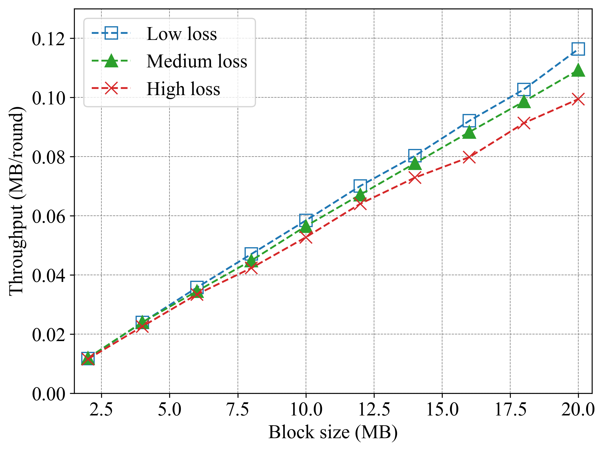

## Featured Examples
The ChainXim simulation system offers multiple pluggable component types across consensus, network, and attack modules, enabling simulation of diverse real-world scenarios. This example provides six distinct modular combination simulation cases without functional overlaps, each comprehensively validating the rationality of ChainXim's simulation results from multiple dimensions. For reproducibility, two implementation schemes are provided for each case: configurations can be applied either through modifying parameter settings in the simulation system's [system_config.ini](system_config.ini) file, or by directly executing provided code snippets in the command-line interface.

### 1. Relationship between the Number of Miners and Block Time in Synchronous Network

ChainXim's synchronous network component can simulate scenarios with zero latency. This example employs this component to investigate the impact of node quantity on block generation time under ideal conditions, while also providing comparative validation of different consensus components. The specific parameter configurations are as follows:

**Parameter settings:**

* Simulation rounds: 600000 rounds

* Number of miners: 10-80

* Consensus type: PoW/VirtualPoW/SolidPoW

* Difficulty: 0000FF...

* q_ave = 10

* Network parameters: SynchronousNetwork

By using the configuration file [synchronous_noadv.ini](conf/synchronous_noadv.ini)，execute the following commands (with corresponding modifications to the miner count and consensus type) to quickly reproduce simulation results for different points under various consensus modules:

```bash
python main.py -c conf/synchronous_noadv.ini --total_round 600000 --consensus_type consensus.PoW --miner_num 10
```

The figure illustrates the relationship between the number of miners in the network and the average block interval. As the number of miners increases, the system's block interval continues to decrease. Different PoW consensus modules share the same core mechanisms, only differing in their application scenarios, thus the results they yield are largely consistent.

---
Average block time variation with number of miners


### 2. Fork Rate, Stale Block Rate, and Consistency under Different Maximum Delays

ChainXim's stochastic propagation network component is configured with two parameters: initial reception probability 'rcvprob_start' and growth probability 'rcvprob_inc'. It specifies that after a message is sent, it has a certain probability of being received by miners in the first round. If it is not received, the reception probability for each miner in subsequent rounds increases by the value specified by the growth parameter. This simulates a delay scenario with a deterministic upper bound but a certain degree of randomness. In this example, the component is used to investigate the impact of different maximum delays on the performance of the blockchain system. The specific parameter settings are as follows:

- Rounds: 3000000
- Number of miners: 20
- Consensus type: PoW
- q_ave: 10
- Difficulty: 000FFF...
- Network types: StochPropNetwork
- Network parameters: rcvprob_start=rcvprob_inc=1/maximum rounds

By using the configuration file [stochprop_noadv.ini](conf/stochprop_noadv.ini)，execute the following commands（with corresponding modifications to the rcvprob_start and rcvprob_inc parameters）to reproduce simulation results：

```bash
python main.py -c conf/stochprop_noadv.ini --total_round 3000000 --rcvprob_start 0.05 --rcvprob_inc 0.05
```

The figure illustrates how the system fork rate and stale rate vary with increasing maximum propagation delay. Both metrics reflect system inconsistency, differing slightly in their statistical approaches. As can be seen, both values show an upward trend as the delay grows while exhibiting minimal differences between them.

---
Fork rate/Stale block rate variation with maximum propagation delay


The figure below illustrates the variation of system consistency with the maximum propagation delay, and Common Prefix[0], [1], [2] represent the first three components of the common prefix PDF, where the ordinal number represents the difference between the common prefix and the main chain length (see the "Simulator Output" section for details).

---
Consistency metrics variation with maximum propagation delay


The plotting code for this example can be found in the file [result_plot.py](util/result_plot.py).

### 3. Growth Rate under Different Single-Round Mining Power

ChainXim's deterministic propagation network component allows the configuration of a reception vector to specify the proportion of miners receiving the message in each round, thereby simulating more precise network latency conditions. This example utilizes this component to simulate and analyze blockchain growth rates under different latency scenarios. The specific parameter settings are as follows:

- Rounds: 4000000
- Number of miners: 20
- Consensus type: PoW/VirtualPoW/SolidPoW
- q_ave: 2-16
- Difficulty: 000FFF...
- Network types: DeterPropNetwork
- Network parameters: prop_vector=[0.3,0.4,0.5,0.6,0.7,0.8,0.9,1.0]

By using the configuration file [deterprop_noadv.ini](conf/deterprop_noadv.ini)，execute the following commands（with corresponding modifications to the q_ave and consensus type）to reproduce simulation results：

```bash
python main.py -c conf/deterprop_noadv.ini --total_round 4000000 --consensus_type consensus.PoW --q_ave 10
```

The figure below illustrates the variation of system throughput with the average computing power of a single node. As can be observed, the throughput increases correspondingly with the enhancement in computing power:

---
Throughput variation with average node computing power


### 4. Fork Rate under Different Mining Difficulty Targets

ChainXim's topology network component can simulate network topologies composed of nodes and edges, enabling more concrete network emulation. This example demonstrates the usage of this component. By connecting nodes in a ring topology and configuring a block size that can be fully propagated within a single round, deterministic network latency conditions are ensured, allowing the theoretical model's approximate solution for fork rate to be used as a reference for validation.

- Rounds: 4000000
- Number of miners: 32
- Consensus type: PoW/VirtualPoW/SolidPoW
- q_ave: 1
- Difficulty: 0000FF...-000FFF... (difficulty=12~16)
- Network types: TopologyNetwork
- Network parameters: init_mode=coo; use round topology

By using the configuration file [topology_noadv.ini](conf/topology_noadv.ini)，execute the following commands（with corresponding modifications to the difficulty and consensus type）to reproduce simulation results：

```bash
python main.py -c conf/topology_noadv.ini --total_round 4000000 --consensus_type consensus.PoW --difficulty 12
```

The figure illustrates how the fork rate changes with the difficulty target. The difficulty target refers to the threshold value that the hash function output must be below. As this target increases, it leads to a higher block generation rate in the system, which in turn causes the fork rate to rise accordingly.

---
​​Fork rate variation with difficulty target


The theoretical curve in the figure is obtained by the following formula:

$$ f=1 - (1 - t)^{mq\sum_{n=1}^{d} i_n} $$

Here, $t$ represents the difficulty target shown on the horizontal axis of the graph, $m$ is the number of miners, and $q$ is the q_ave, denoting the average number of hash queries performed by each miner per round. $i_n$ represents the proportion of miners in the entire network that receive the block in the nth round after the block is propagated.


### 5. Throughput and Fork Rate under Different Block Sizes

ChainXim's ad-hoc network component simulates a more realistic networking scenario, where mobile nodes dynamically alter the network topology. This example demonstrates the usage of this component and investigates the impact of block size on blockchain system performance. The specific parameter configurations are as follows:

- Rounds: 4000000
- Number of miners: 40
- Consensus type: PoW
- q_ave: 10
- Blocksize: 2-20MB
- Difficulty: 0000FF...
- Network type: AdHocNetwork
- Network parameters: ave_degree=3, region_width=100, comm_range=30, move_variance=5, outage_prob=0.01, 
bandwidth_max=100, enable_large_scale_fading = True, path_loss_level = low/medium/high

By using the configuration file [adhoc_noadv.ini](conf/adhoc_noadv.ini)，execute the following commands（with corresponding modifications to the blocksize and path_loss_level）to reproduce simulation results：

```bash
python main.py -c conf/adhoc_noadv.ini --total_round 4000000 --path_loss_level low --blocksize 2
```

The figure below illustrates how throughput varies with block size. As the block size increases, it leads to longer latency, thereby reducing the growth rate of the blockchain system and causing the growth of throughput (measured in MB) to gradually slow down. Greater path loss also leads to a decrease in throughput.

---
Throughput variation with block size



The figure below illustrates the variation in forking rate with block size. Worse network latency conditions and greater path loss result in a higher forking rate.

---
Fork rate variation with block size


### 6. Attacker's Block Proportion under Different Attack Vectors

This example sequentially demonstrates the usage of four available attack modules:

#### a. Honest Mining Attack

ChainXim's honest mining attack component simulates the most basic attack method, where attackers combine their hash power to conduct honest mining. Typically, the proportion of blocks mined by attackers in the network will approximately equal their share of the total computing power. This example investigates the success rate of such attacks under various network latency scenarios by combining different network components:

**Parameter settings:**

* Rounds: 3000000 rounds

* Number of miners: 100

* Consensus type: PoW

* Difficulty: 000FFF...

* q_ave = 1

* Network parameters: `blocksize=4`, the bandwidth of the edges in `TopologyNetwork` is `2MB/round` with dynamic topology enabled, and bandwidth_max=40 in `AdhocNetwork`. Other network parameters are set to default values.

By using the configuration file [pow_doublespending.ini](conf/pow_doublespending.ini), execute the following commands（with corresponding modifications to the network_type and adver_num）to reproduce simulation results：

```bash
python main.py -c conf/pow_doublespending.ini --total_round 3000000 --q_ave 1 --attack_type HonestMining --network_type network.SynchronousNetwork --adver_num 5
```

---
Impact of Different Networks on Honest Mining Attack


Definition of a successful attack is that the attacker produces a block and is accepted by the network. The vertical axis represents the chain quality, defined as the difference between 1 and the proportion of blocks produced by the attackers that are included in the main chain.

---
#### b. Selfish Mining Attack

ChainXim's selfish mining attack component simulates the strategy that malicious miners deliberately delay broadcasting newly mined blocks to gain unfair advantages. This example examines the attack's success rate under varying network latency conditions by integrating different network modules. The specific experimental parameters are configured as follows:

**Parameter settings:**

* Simulation rounds: 3000000 rounds

* Number of miners: 100

* Consensus type: PoW

* Difficulty: 0000FF...

* q_ave = 10

* Network parameters: identical to that of honest mining
[pow_doublespending.ini](conf/pow_doublespending.ini)

By using the configuration file [pow_doublespending.ini](conf/pow_doublespending.ini), execute the following commands（with corresponding modifications to the network_type and adver_num）to reproduce simulation results：

```bash
python main.py -c conf/pow_doublespending.ini --total_round 3000000 --difficulty 16 --q_ave 10 --attack_type SelfishMining --network_type network.SynchronousNetwork --adver_num 5
```

---
Impact of Different Networks on Selfish Mining Attack


Under synchronous network, the chain quality of this attack can be theoretically determined, while in other networks, the chain quality will experience varying degrees of degradation depending on their respective latency conditions.

The theoretical curve in the figure is obtained by the following formula:

$$ R=\frac{4\alpha^{2}(1-\alpha)^{2}-\alpha^{3}}{1-\alpha(1+(2-\alpha)\alpha)} $$

Here $\alpha$ represents the attackers' proportion.

---
#### c. Double Spending Attack

ChainXim's double-spend attack component simulates this classic blockchain attack that rewrites transaction history. This case demonstrates the component's operation methodology while evaluating attack success rates through integration with various network components.

**Parameter settings:**

* Simulation rounds: 3000000 rounds

* Number of miners: 100

* Consensus type: PoW

* Difficulty: 000FFF...

* q_ave = 3

* Network parameters: identical to that of honest mining

* Attack parameters: Ng=3, N=1

By using the configuration file [pow_doublespending.ini](conf/pow_doublespending.ini), execute the following commands（with corresponding modifications to the network_type and adver_num）to reproduce simulation results：

```bash
python main.py -c conf/pow_doublespending.ini --total_round 3000000 --network_type network.SynchronousNetwork --adver_num 5
```

---
Impact of Different Networks on Double Spending Attack


This result is somewhat similar to that of selfish mining, where networks with poorer latency conditions exhibit higher attack success rates.

---
Besides latency, the attacker's strategy is also a critical factor affecting the success rate of a double-spending attack. The synchronous network component can be employed to directly investigate this influencing.

**Parameter settings:**

* Simulation rounds: 5000000 rounds

* Number of miners: 20

* Consensus type: PoW

* Difficulty: 000FFF...

* q_ave = 1

* Network parameters: SynchronousNetwork

* Attack parameters: Ng=10, N=1/3/6

By using the configuration file [synchronous_doublespending.ini](conf/synchronous_doublespending.ini), execute the following commands（with corresponding modifications to the adver_num and N）to reproduce simulation results：

```bash
python main.py -c conf/synchronous_doublespending.ini --total_round 5000000 -N 1 --adver_num 5
```

---
Impact of Different Strategies on Double Spending Attack and Theoretical Comparison


Under a synchronous network, the success rate of this attack can be theoretically derived, indicating that the fewer the number of block confirmations awaited, the higher the likelihood of a successful attack.

The theoretical curve in the figure is obtained by the following formula:

$$P(N,N_g,\beta)=1-\sum_{n=0}^{N}\begin{pmatrix}n+N-1\\
n
\end{pmatrix}\left(\frac{1}{1+\beta}\right)^{N}\left(\frac{\beta}{1+\beta}\right)^{n}\left(\frac{1-\beta^{N-n+1}}{1-\beta^{Ng+1}}\right)$$

$N$ is the number of blocks the attacker waits for confirmation, i.e., the attacker will wait for the honest chain to grow by $N$ blocks before deciding whether to publish.
$N_g$ indicates that the attacker abandons the current attack when it is $N_g$ blocks behind the honest chain.
$\beta$ is the ratio of the attacker's hash power to that of the honest miners, $0\leqslant\beta\leqslant1$.

---
#### d. Eclipsed Double Spending

This example shows how to use the eclipse attack component. The attacking nodes control the victim's message reception, making it only receive blocks from the attackers. When using this attack component in ChainXim, set the network module to the topology network component and design a specific static topology. Two sample topologies are shown below:​

  

  

  In each topology, the attacked node is only connected to the attacker, facilitating the attacker's ability to launch attacks, while the attacker maintains full connections with all other nodes. This configuration enables comparative simulations with fully-connected topology networks.

**Parameter settings:**

* Simulation rounds: 5000000 rounds

* Number of miners: 10

* Consensus type: PoW

* Difficulty: 0000FF...

* q_ave = 10

* Network type: TopologyNetwork

* Block size: 0 MB

First, simulate under fully connected network conditions and execute the commands:

````bash
python main.py -c conf/topology_eclipsed.ini --total_round 5000000 --adver_list "(0,)"
python main.py -c conf/topology_eclipsed.ini --total_round 5000000 --adver_list "(0,1)"
python main.py -c conf/topology_eclipsed.ini --total_round 5000000 --adver_list "(0,1,2)"
python main.py -c conf/topology_eclipsed.ini --total_round 5000000 --adver_list "(0,1,2,3)"
````

Then, using the configuration file [topology_eclipsed.ini](conf/topology_eclipsed.ini)，execute the following command (modify accordingly with the attacker's ID, the attacked miner ID, and network topology)：

```bash
python main.py -c conf/topology_eclipsed.ini --total_round 5000000 --topology_path conf/topologies/eclipse_0_1.csv --eclipse_target "(0,)" --adver_list "(1,)"
python main.py -c conf/topology_eclipsed.ini --total_round 5000000 --topology_path conf/topologies/eclipse_0_12.csv --eclipse_target "(0,)" --adver_list "(1,2)"
python main.py -c conf/topology_eclipsed.ini --total_round 5000000 --topology_path conf/topologies/eclipse_0_123.csv --eclipse_target "(0,)" --adver_list "(1,2,3)"
python main.py -c conf/topology_eclipsed.ini --total_round 5000000 --topology_path conf/topologies/eclipse_01_2.csv --eclipse_target "(0,1)" --adver_list "(2,)"
python main.py -c conf/topology_eclipsed.ini --total_round 5000000 --topology_path conf/topologies/eclipse_01_23.csv --eclipse_target "(0,1)" --adver_list "(2,3)"
python main.py -c conf/topology_eclipsed.ini --total_round 5000000 --topology_path conf/topologies/eclipse_012_3.csv --eclipse_target "(0,1,2)" --adver_list "(3,)"
```

---
Double Spending Attack under Eclipse Attack


When the attack proceeds smoothly, the attacked node will only mine after the attacker's block, meaning its computing power is effectively utilized by the attacker. Consequently, the success rate of the eclipsed double-spending attack becomes equivalent to that of the double-spending attack launched under a fully connected network scenario with the combined computing power of both parties. The plotting code for this example can be found in the file [result_plot.py](util/result_plot.py).
        

