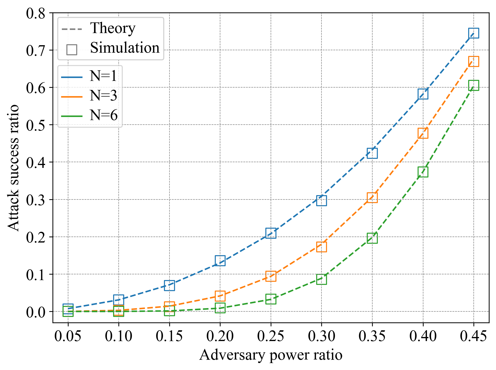
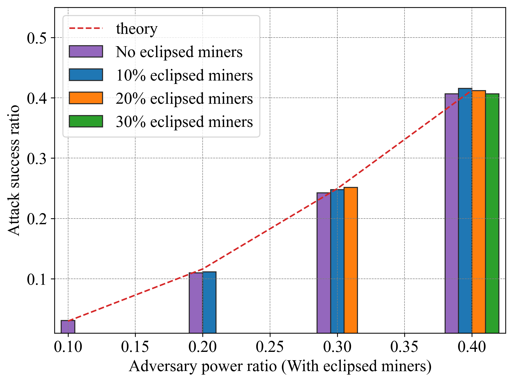

## 精选示例 Featured Examples
在本文档中，我们使用ChainXim进行实验，展示结果，并将其中一些结果与理论值进行比较。

### 同步网络中矿工数量与出块时间的关系

**参数设置如下：**

* 仿真次数：200000轮

* 矿工数：10-80

* 共识类型：PoW/VirtualPoW/SolidPoW

* 难度：0000FF...

* q_ave = 10

* 网络参数：SynchronousNetwork


使用配置文件[synchronous_noadv.ini](conf/synchronous_noadv.ini)，执行以下命令（需要相应修改矿工数和共识类型）：

```bash
python main.py -c conf/synchronous_noadv.ini --consensus_type consensus.PoW --miner_num 10
```


### 不同网络最大时延下的分叉率、孤块率与一致性
* 轮数：1000000

* 矿工数：20

* 共识类型：PoW

* q_ave:10

* 难度：000FFF...

* 网络类型：StochPropNetwork

* 网络参数：rcvprob_start=rcvprob_inc=1/最大轮数

使用配置文件[stochprop_noadv.ini](conf/stochprop_noadv.ini)，执行以下命令（需要相应修改rcvprob_start和rcvprob_inc）：

```bash
python main.py -c conf/stochprop_noadv.ini --rcvprob_start 0.05 --rcvprob_inc 0.05
```

---
分叉率/孤块率随最大传播时延的变化示意图


---
一致性指标随最大传播时延的变化示意图


图中，Common Prefix[0]、[1]、[2]分别代表共同前缀PDF的前三个分量,其中序数代表共同前缀与主链长度的差值（详见“仿真器输出”一节）。


### 不同单轮哈希算力下的增长率
* 轮数：1500000

* 矿工数：20

* 共识类型：PoW/VirtualPoW/SolidPoW

* q_ave:2-16

* 难度：000FFF...

* 网络类型：DeterPropNetwork

* 网络参数：prop_vector=[0.3,0.4,0.5,0.6,0.7,0.8,0.9,1.0]


使用配置文件[deterprop_noadv.ini](conf/deterprop_noadv.ini)，执行以下命令（需要相应修改q_ave和共识类型）：

```bash
python main.py -c conf/deterprop_noadv.ini --consensus_type consensus.PoW --q_ave 10
```


### 不同挖矿难度目标下的分叉率
* 轮数：1000000

* 矿工数：32

* 共识类型：PoW/VirtualPoW/SolidPoW

* q_ave:1

* 区块大小：0MB

* 难度：0000FF...-000FFF... (difficulty=12~16)

* 网络类型：TopologyNetwork

* 网络参数：init_mode=coo; 采用环形拓扑


使用配置文件[topology_noadv.ini](conf/topology_noadv.ini)，执行以下命令（需要相应修改difficulty和共识类型）：

```bash
python main.py -c conf/topology_noadv.ini --consensus_type consensus.PoW --difficulty 12
```


图中的理论曲线由以下公式得到：

$$ f=1 - (1 - t)^{mq\sum_{n=1}^{d} i_n} $$

$t$即为图中横坐标展示的难度目标，$m$为矿工数量，$q$即为q_ave，表示平均每个矿工每一轮进行哈希查询的次数。
$i_n$表示在区块发出后的第n个轮次，收到该区块的矿工在全网的占比。

### 不同区块大小下的吞吐量与分叉率
* 轮数：1000000

* 矿工数：40

* 共识类型：PoW

* q_ave:10

* 区块大小：2-20MB

* 难度：0000FF...

* 网络类型：AdHocNetwork

* 网络参数：ave_degree=3, region_width=100, comm_range=30, move_variance=5, outage_prob=0.01, 
bandwidth_max=100, enable_large_scale_fading = True, path_loss_level = low/medium/high

使用配置文件[adhoc_noadv.ini](conf/adhoc_noadv.ini)，执行以下命令（需要相应修改区块大小和共识类型）：

```bash
python main.py -c conf/adhoc_noadv.ini --consensus_type consensus.PoW --blocksize 2
```

---
吞吐量随区块大小的变化示意图


---
分叉率随区块大小的变化示意图


### 不同攻击向量下的攻击者出块占比示意图


#### 1. 算力攻击（honest mining）

##### **不同网络对算力攻击的影响示意图**


一次攻击成功的定义为攻击者产出区块，并被网络接受。
图中纵坐标为链质量指标，即攻击者产出区块在主链中的占比与1之差。

**参数设置如下：**

- 仿真次数：1000000轮
- 矿工数：100
- 共识类型：PoW
- 难度：000FFF...
- q_ave = 1
- 网络参数：blocksize=4; TopologyNetwork中带宽均为2, 且开启动态拓扑; AdhocNetwork中最大带宽为40;
    其余网络参数为默认参数。

使用配置文件[pow_doublespending.ini](conf/pow_doublespending.ini)，执行以下命令（需要相应修改攻击者数量和网络类型）：

```bash
python main.py -c conf/pow_doublespending.ini --total_round 1000000 --q_ave 1 --attack_type HonestMining --network_type network.SynchronousNetwork --adver_num 5
```

---
#### 2. 区块截留攻击（selfish mining）

##### **不同网络对区块截留攻击的影响示意图**


**参数设置如下：**

- 仿真次数：1000000轮
- 矿工数：100
- 共识类型：PoW
- 难度：0000FF...
- q_ave = 10
- 网络参数：与算力攻击一样

使用配置文件[pow_doublespending.ini](conf/pow_doublespending.ini)，执行以下命令（需要相应修改攻击者数量和网络类型）：

```bash
python main.py -c conf/pow_doublespending.ini --total_round 1000000 --difficulty 16 --q_ave 10 --attack_type SelfishMining --network_type network.SynchronousNetwork --adver_num 5
```

图中的理论曲线由以下公式得到：

$$ R=\frac{4\alpha^{2}(1-\alpha)^{2}-\alpha^{3}}{1-\alpha(1+(2-\alpha)\alpha)} $$

---
#### 3. 双花攻击（double spending）

##### **不同网络对双花攻击的影响示意图**


**参数设置如下：**

- 仿真次数：3000000轮
- 矿工数：100
- 共识类型：PoW
- 难度：000FFF...
- q_ave = 3
- 网络参数：与算力攻击一样
- 攻击参数：Ng=3, N=1 

使用配置文件[pow_doublespending.ini](conf/pow_doublespending.ini)，执行以下命令（需要相应修改攻击者数量和网络类型）：

```bash
python main.py -c conf/pow_doublespending.ini --network_type network.SynchronousNetwork --adver_num 5
```

---
##### **不同策略对双花攻击的影响与理论对比示意图**



**参数设置如下：**

- 仿真次数：5000000轮
- 矿工数：20
- 共识类型：PoW
- 难度：000FFF...
- q_ave = 1
- 网络类型：SynchronousNetwork
- 攻击参数：Ng=10, N=1/3/6 

使用配置文件[synchronous_doublespending.ini](conf/synchronous_doublespending.ini)，执行以下命令（需要相应修改攻击者数量和N）：

```bash
python main.py -c conf/synchronous_doublespending.ini -N 1 --adver_num 5
```

图中的理论曲线由以下公式得到：

$$P(N,N_g,\beta)=1-\sum_{n=0}^{N}\begin{pmatrix}n+N-1\\
n
\end{pmatrix}\left(\frac{1}{1+\beta}\right)^{N}\left(\frac{\beta}{1+\beta}\right)^{n}\left(\frac{1-\beta^{N-n+1}}{1-\beta^{Ng+1}}\right)$$

$N$为攻击者等待确认区块的数量，即攻击者会等待诚实链高度增长$N$个区块后才会选择发布与否。
$N_g$表示当攻击者落后诚实链$N_g$个区块时放弃当前攻击。
$\beta$为攻击者与诚实矿工算力之比，$0\leqslant\beta\leqslant1$。

---
#### 4. 日蚀攻击（eclipsed double spending）

##### **受日蚀攻击影响下的双花攻击示意图**



**参数设置如下：**

- 仿真次数：1000000轮
- 矿工数：10
- 共识类型：PoW
- 难度：0000FF...
- q_ave = 10
- 网络类型：TopologyNetwork
- 区块大小：0MB
- 网络参数：使用如下类型的拓扑

先在全连接网络条件下进行仿真，执行以下命令：

````bash
python main.py -c conf/topology_eclipsed.ini --adver_list "(0,)"
python main.py -c conf/topology_eclipsed.ini --adver_list "(0,1)"
python main.py -c conf/topology_eclipsed.ini --adver_list "(0,1,2)"
python main.py -c conf/topology_eclipsed.ini --adver_list "(0,1,2,3)"
````

然后使用配置文件[topology_eclipsed.ini](conf/topology_eclipsed.ini)，执行以下命令（需要相应修改攻击者ID、被月蚀攻击的矿工ID和网络拓扑）：

```bash
python main.py -c conf/topology_eclipsed.ini --topology_path conf/topologies/eclipse_0_1.csv --eclipse_target "(0,)" --adver_list "(1,)"
python main.py -c conf/topology_eclipsed.ini --topology_path conf/topologies/eclipse_0_12.csv --eclipse_target "(0,)" --adver_list "(1,2)"
python main.py -c conf/topology_eclipsed.ini --topology_path conf/topologies/eclipse_0_123.csv --eclipse_target "(0,)" --adver_list "(1,2,3)"
python main.py -c conf/topology_eclipsed.ini --topology_path conf/topologies/eclipse_01_2.csv --eclipse_target "(0,1)" --adver_list "(2,)"
python main.py -c conf/topology_eclipsed.ini --topology_path conf/topologies/eclipse_01_23.csv --eclipse_target "(0,1)" --adver_list "(2,3)"
python main.py -c conf/topology_eclipsed.ini --topology_path conf/topologies/eclipse_012_3.csv --eclipse_target "(0,1,2)" --adver_list "(3,)"
```


所有拓扑中，被攻击节点只能与攻击者链接，而攻击者与其它所有节点是全连接。

